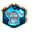

# Bosses — Artifacts

1 artifact with an animated icon.

Icons: `public/resources/icons/{id}.png` + `{id}.plist` (CC0, open-duelyst).
Artifacts have no per-artifact VFX — they share `fx_artifacthit` and `fx_artifactbreak`.

| Icon | Name | Id | Frames |
| --- | --- | --- | --- |
|  | Frostarmor | `artifact_boss_frostarmor` | 30 |
