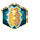
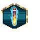
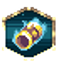

# Lyonar Kingdoms — Artifacts

8 artifacts with an animated icon.

Icons: `public/resources/icons/{id}.png` + `{id}.plist` (CC0, open-duelyst).
Artifacts have no per-artifact VFX — they share `fx_artifacthit` and `fx_artifactbreak`.

| Icon | Name | Id | Frames |
| --- | --- | --- | --- |
|  | Arclyteregalia | `artifact_f1_arclyteregalia` | 30 |
|  | Bigshield | `artifact_f1_bigshield` | 30 |
|  | Dawnseye | `artifact_f1_dawnseye` | 30 |
|  | Goldenvitriol | `artifact_f1_goldenvitriol` | 30 |
|  | Ironbanner | `artifact_f1_ironbanner` | 30 |
|  | Shieldofphalanx | `artifact_f1_shieldofphalanx` | 30 |
|  | Skywindglaives | `artifact_f1_skywindglaives` | 30 |
|  | Sunstonebracers | `artifact_f1_sunstonebracers` | 30 |
