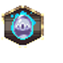
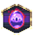
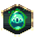
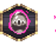

# Neutral — Artifacts

7 artifacts with an animated icon.

Icons: `public/resources/icons/{id}.png` + `{id}.plist` (CC0, open-duelyst).
Artifacts have no per-artifact VFX — they share `fx_artifacthit` and `fx_artifactbreak`.

| Icon | Name | Id | Frames |
| --- | --- | --- | --- |
|  | F1 Goldenhammer | `artifact_neutral_f1_goldenhammer` | 30 |
|  | F2 Goldenhammer | `artifact_neutral_f2_goldenhammer` | 30 |
|  | F3 Goldenhammer | `artifact_neutral_f3_goldenhammer` | 30 |
|  | F4 Goldenhammer | `artifact_neutral_f4_goldenhammer` | 30 |
|  | F5 Goldenhammer | `artifact_neutral_f5_goldenhammer` | 30 |
|  | F6 Goldenhammer | `artifact_neutral_f6_goldenhammer` | 30 |
|  | Neutral Goldenhammer | `artifact_neutral_neutral_goldenhammer` | 30 |
