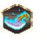
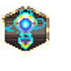
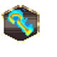
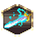
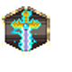
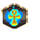

# Vetruvian Imperium — Artifacts

8 artifacts with an animated icon.

Icons: `public/resources/icons/{id}.png` + `{id}.plist` (CC0, open-duelyst).
Artifacts have no per-artifact VFX — they share `fx_artifacthit` and `fx_artifactbreak`.

| Icon | Name | Id | Frames |
| --- | --- | --- | --- |
|  | Hexblade | `artifact_f3_hexblade` | 30 |
|  | Repairstaff | `artifact_f3_repairstaff` | 30 |
|  | Sajjreredemption | `artifact_f3_sajjreredemption` | 30 |
|  | Sandscepter | `artifact_f3_sandscepter` | 30 |
|  | Spinecleaver | `artifact_f3_spinecleaver` | 30 |
|  | Staffofykir | `artifact_f3_staffofykir` | 30 |
|  | Thunderclap | `artifact_f3_thunderclap` | 30 |
|  | Wildfireankh | `artifact_f3_wildfireankh` | 30 |
