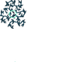

# Magmar Aspects — Spells

14 spells shipping both an animated icon and a cast VFX.

Icons: `public/resources/icons/{id}.png` + `{id}.plist`.
VFX: `public/resources/fx/{id}.png` + `{id}.plist`. (CC0, open-duelyst.)

| Icon | VFX | Name | Icon id | Icon frames | VFX id (frames) |
| --- | --- | --- | --- | --- | --- |
|  |  | Amplification | `icon_f5_amplification` | 27 | `fx_f5_amplification` (25) |
|  |  | Boundedlifeforce | `icon_f5_boundedlifeforce` | 11 | `fx_f5_boundedlife` (37) |
|  |  | Earthsphere | `icon_f5_earthsphere` | 11 | `fx_f5_earthsphere` (31) `fx_f5_earthsphere_blue` (31) `fx_f5_earthsphere_orange` (31) |
|  |  | Egg *(bloodbound)* | `generalspell_f5_egg` | 17 | `fx_f5_bbs_egg` (62) |
|  |  | Flamingstampede | `icon_f5_flamingstampede` | 18 | `f5_fx_flamingstampede` (31) |
|  |  | Flashreincarnation | `icon_f5_flashreincarnation` | 24 | `fx_f5_flashreincarnation` (24) |
|  |  | Fractalreplication | `icon_f5_fractalreplication` | 21 | `fx_f5_fractalreplication` (23) |
|  |  | Kineticequilibrium | `icon_f5_kineticequilibrium` | 24 | `fx_f5_kinectequilibrium` (21) |
|  |  | Manaburn | `icon_f5_manaburn` | 12 | `fx_f5_manaburn` (24) |
|  |  | Mindsteal | `icon_f5_mindsteal` | 10 | `fx_f5_mindsteal` (28) |
|  |  | Naturalselection | `icon_f5_naturalselection` | 24 | `fx_f5_naturalselection` (23) |
|  |  | Overload *(bloodbound)* | `generalspell_f5_overload` | 32 | `fx_f5_bbs_overload` (46) |
|  |  | Seekingeye *(bloodbound)* | `generalspell_f5_seekingeye` | 32 | `fx_f5_bbs_seekingeye` (43) |
|  |  | Tremor | `icon_f5_tremor` | 11 | `fx_f5_tremor` (32) |
