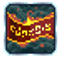
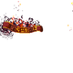

# Neutral — Spells

1 spell shipping both an animated icon and a cast VFX.

Icons: `public/resources/icons/{id}.png` + `{id}.plist`.
VFX: `public/resources/fx/{id}.png` + `{id}.plist`. (CC0, open-duelyst.)

| Icon | VFX | Name | Icon id | Icon frames | VFX id (frames) |
| --- | --- | --- | --- | --- | --- |
|  |  | Riddle | `icon_neutral_riddle` | 13 | `fx_neutral_riddle` (38) |
