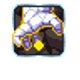
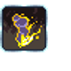

# Vetruvian Imperium — Spells

13 spells shipping both an animated icon and a cast VFX.

Icons: `public/resources/icons/{id}.png` + `{id}.plist`.
VFX: `public/resources/fx/{id}.png` + `{id}.plist`. (CC0, open-duelyst.)

| Icon | VFX | Name | Icon id | Icon frames | VFX id (frames) |
| --- | --- | --- | --- | --- | --- |
|  |  | Aurorastear | `icon_f3_aurorastear` | 24 | `fx_f3_aurorastears` (25) |
|  |  | Blindscorch | `icon_f3_blindscorch` | 21 | `fx_f3_blindscorch` (41) |
|  |  | Boneswarm | `icon_f3_boneswarm` | 26 | `fx_f3_boneswarm` (22) |
|  |  | Circleofdessication | `icon_f3_circleofdessication` | 18 | `f3_fx_circleofdessication` (27) |
|  |  | Cosmicflesh | `icon_f3_cosmicflesh` | 33 | `fx_f3_cosmicflesh` (27) |
|  |  | Entropicdecay | `icon_f3_entropicdecay` | 17 | `f3_fx_entropicdecay` (33) |
|  |  | Fountainofyouth | `icon_f3_fountainofyouth` | 25 | `fx_f3_fountainofyouth` (23) |
|  | — | Hex *(bloodbound)* | `generalspell_f3_hex` | 18 | `fx_f3_bbs_hex` (50) |
|  |  | Rashascurse | `icon_f3_rashascurse` | 17 | `fx_f3_rashascurse` (26) |
|  |  | Scionsfirstwish | `icon_f3_scionsfirstwish` | 33 | `fx_f3_scionsfirstwish` (31) |
|  |  | Scionssecondwish | `icon_f3_scionssecondwish` | 36 | `fx_f3_scionssecondwish` (31) |
|  |  | Scionsthirdwish | `icon_f3_scionsthirdwish` | 42 | `fx_f3_scionsthirdwish` (31) |
|  |  | Starsfury | `icon_f3_starsfury` | 31 | `fx_f3_starsfury` (46) |
