# Abyssian Host

57 units with a complete animation set (`idle`, `attack`, `death`).

Sprites: `public/resources/units/{id}.png` + `{id}_atlas.json` (CC0, open-duelyst).

| Sprite | Name | Id | Animations |
| --- | --- | --- | --- |
| 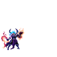 | 3rdgeneral | `f4_3rdgeneral` | attack (33), breathing (14), cast (17), castend (5), castloop (4), caststart (5), death (11), hit (3), idle (16), run (10) |
|  | Abyssiansentinel | `f4_abyssiansentinel` | attack (23), breathing (14), death (31), hit (3), idle (27), run (8) |
| 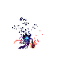 | Altgeneral | `f4_altgeneral` | attack (29), breathing (14), cast (9), castend (4), castloop (6), caststart (4), death (21), hit (3), idle (11), run (8) |
| 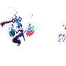 | Altgeneraltier2 | `f4_altgeneraltier2` | attack (25), breathing (14), cast (9), castend (5), castloop (6), caststart (5), death (21), hit (3), idle (13), run (6) |
| 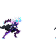 | Arachne | `f4_arachne` | attack (33), breathing (14), death (14), hit (3), idle (10), run (6) |
| 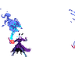 | Arcanedevourer | `f4_arcanedevourer` | attack (16), breathing (14), death (16), hit (3), idle (14), run (8) |
| 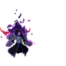 | Blacksolus | `f4_blacksolus` | attack (35), breathing (12), death (27), hit (5), idle (8), run (6) |
| 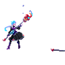 | Bloodbaronette | `f4_bloodbaronette` | attack (29), breathing (14), death (27), hit (3), idle (13), run (8) |
| 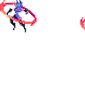 | Bloodmoon | `f4_bloodmoon` | attack (12), breathing (14), death (8), hit (3), idle (12), run (8) |
| 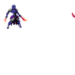 | Buildcommon | `f4_buildcommon` | attack (22), breathing (14), death (10), hit (3), idle (12), run (8) |
|  | Buildlegendary | `f4_buildlegendary` | attack (21), breathing (14), death (19), hit (3), idle (14) |
| 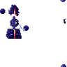 | Buildminion | `f4_buildminion` | attack (20), breathing (14), death (22), hit (3), idle (14) |
| 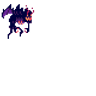 | Crawler | `f4_crawler` | attack (10), breathing (14), damage (3), death (8), idle (12), run (6) |
| 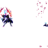 | Creepmangler | `f4_creepmangler` | attack (32), breathing (14), death (16), hit (3), idle (16), run (8) |
|  | Creepydemon | `f4_creepydemon` | attack (20), breathing (12), death (15), hit (3), idle (20), run (6) |
| 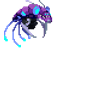 | Daemondeep | `f4_daemondeep` | attack (16), breathing (12), death (9), hit (3), idle (12), run (6) |
| 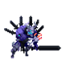 | Daemongate | `f4_daemongate` | attack (16), breathing (14), death (7), hit (3), idle (14), run (8) |
| 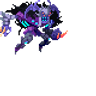 | Daemonvoid | `f4_daemonvoid` | attack (20), breathing (16), death (12), hit (3), idle (16), run (8) |
| 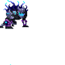 | Darkspine | `f4_darkspine` | attack (9), breathing (15), death (10), hit (3), idle (12), run (8) |
| 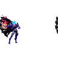 | Deathknell | `f4_deathknell` | attack (26), breathing (14), death (15), hit (3), idle (14), run (8) |
| 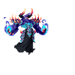 | Demonofeternity | `f4_demonofeternity` | attack (28), breathing (18), death (15), hit (3), idle (20), run (10) |
| 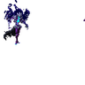 | Desolater | `f4_desolater` | attack (19), breathing (14), death (20), hit (3), idle (24), run (8) |
| 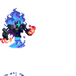 | Engulfingshadow | `f4_engulfingshadow` | attack (13), breathing (14), death (9), hit (3), idle (14), run (6) |
|  | Fallenaspect | `f4_fallenaspect` | attack (19), breathing (14), death (16), hit (3), idle (14), run (9) |
| 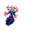 | Furosa | `f4_furosa` | attack (40), breathing (14), death (27), hit (3), idle (12), run (8) |
| 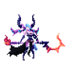 | General | `f4_general` | attack (12), breathing (14), cast (13), castend (3), castloop (8), caststart (3), death (10), hit (3), idle (11), run (8) |
|  | Gloomchaser | `f4_gloomchaser` | attack (12), breathing (14), damage (3), death (9), idle (12), projectile (5), run (12) |
| 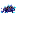 | Gor | `f4_gor` | attack (19), breathing (12), death (10), hit (3), idle (12), run (8) |
| 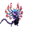 | Grandmastervariax | `f4_grandmastervariax` | attack (20), breathing (14), death (20), hit (3), idle (14), run (8) |
| 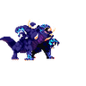 | Horror | `f4_horror` | attack (15), breathing (14), death (14), hit (3), idle (14), run (8) |
| 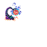 | Horrorburster | `f4_horrorburster` | attack (26), breathing (14), death (16), hit (3), idle (14), run (8) |
|  | Husk | `f4_husk` | attack (22), breathing (14), death (22), hit (3), idle (12), run (8) |
| 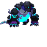 | Juggernaut | `f4_juggernaut` | attack (14), breathing (14), death (8), hit (3), idle (12), run (8) |
| 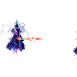 | Klaxon | `f4_klaxon` | attack (33), breathing (14), death (20), hit (3), idle (18), run (7) |
|  | Limbodweller | `f4_limbodweller` | attack (28), breathing (14), death (21), hit (3), idle (24), run (8) |
|  | Maehvmk2 | `f4_maehvmk2` | attack (29), breathing (14), cast (11), castend (5), castloop (5), caststart (4), death (19), hit (3), idle (20), run (8) |
| 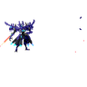 | Mech | `f4_mech` | attack (22), breathing (14), death (18), hit (3), idle (14), run (8) |
| 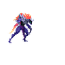 | Megafiend | `f4_megafiend` | attack (22), breathing (14), death (15), hit (3), idle (8), run (8) |
| 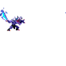 | Miniminion | `f4_miniminion` | attack (32), breathing (14), death (14), hit (3), idle (20), run (8) |
|  | Mistressofcommands | `f4_mistressofcommands` | attack (30), breathing (14), death (14), hit (3), idle (14), run (6) |
| 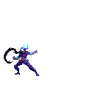 | Moonrider | `f4_moonrider` | attack (34), breathing (14), death (24), hit (3), idle (12), run (8) |
| 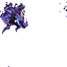 | Nightfiend | `f4_nightfiend` | attack (23), breathing (14), death (18), hit (3), idle (13), run (8) |
| 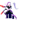 | Nightsorrow | `f4_nightsorrow` | attack (14), breathing (14), death (11), hit (3), idle (12), run (8) |
| 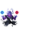 | Nocturn | `f4_nocturn` | attack (23), breathing (14), death (15), hit (3), idle (9), run (8) |
|  | Ooz | `f4_ooz` | attack (22), breathing (12), death (15), hit (3), idle (12), run (8) |
| 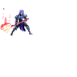 | Phantasm | `f4_phantasm` | attack (35), breathing (14), death (35), hit (3), idle (22), run (8) |
| 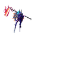 | Pitstrider | `f4_pitstrider` | attack (20), breathing (14), death (17), hit (3), idle (14), run (10) |
| 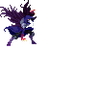 | Plaguedr | `f4_plaguedr` | attack (22), breathing (14), death (21), hit (3), idle (12), run (8) |
| 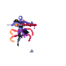 | Reaperninemoons | `f4_reaperninemoons` | attack (31), breathing (10), death (26), hit (5), idle (30), run (4) |
| 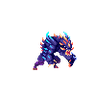 | Remora | `f4_remora` | attack (43), breathing (14), death (13), hit (3), idle (21), run (8) |
|  | Shadowdancer | `f4_shadowdancer` | attack (12), breathing (14), death (9), hit (3), idle (12), run (8) |
| 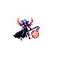 | Sinergyunit | `f4_sinergyunit` | attack (33), breathing (14), death (16), hit (3), idle (16), run (8) |
| 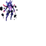 | Siren | `f4_siren` | attack (14), breathing (14), death (9), hit (3), idle (10), run (10) |
| 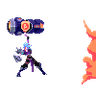 | Sister | `f4_sister` | attack (22), breathing (14), death (24), hit (3), idle (14), run (8) |
| 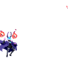 | Skullcaster | `f4_skullcaster` | attack (28), breathing (14), death (25), hit (3), idle (20), run (8) |
| 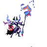 | Tier2general | `f4_tier2general` | attack (25), breathing (14), cast (15), castend (4), castloop (14), caststart (4), death (20), hit (3), idle (20), run (8) |
| 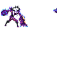 | Underworldbrute | `f4_underworldbrute` | attack (23), breathing (14), death (16), hit (3), idle (14), run (8) |
