# Bosses

50 units with a complete animation set (`idle`, `attack`, `death`).

Sprites: `public/resources/units/{id}.png` + `{id}_atlas.json` (CC0, open-duelyst).

| Sprite | Name | Id | Animations |
| --- | --- | --- | --- |
| 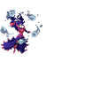 | Andromeda | `boss_andromeda` | attack (23), breathing (10), death (13), hit (3), idle (10), run (8) |
| 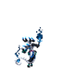 | Antiswarm | `boss_antiswarm` | attack (43), breathing (14), death (27), hit (3), idle (17), run (8) |
| 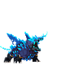 | Borealjuggernaut | `boss_borealjuggernaut` | attack (26), breathing (14), death (21), hit (3), idle (16), run (8) |
|  | Candypanda | `boss_candypanda` | attack (31), breathing (14), death (25), hit (3), idle (14), run (8) |
| 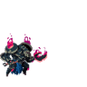 | Chaosknight | `boss_chaosknight` | attack (39), breathing (14), death (25), hit (3), idle (16), run (10) |
| 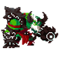 | Christmas | `boss_christmas` | attack (27), breathing (14), death (10), hit (3), idle (14), run (8) |
| 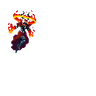 | Cindera | `boss_cindera` | attack (40), breathing (14), death (27), hit (3), idle (12), run (8) |
| 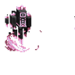 | City | `boss_city` | attack (14), breathing (12), death (20), hit (3), idle (11) |
| 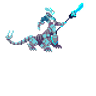 | Crystal | `boss_crystal` | attack (15), breathing (14), death (11), hit (3), idle (8), run (8) |
| 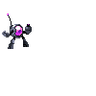 | Decepticle | `boss_decepticle` | attack (42), breathing (14), death (14), hit (4), idle (19), run (8) |
| 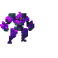 | Decepticlechassis | `boss_decepticlechassis` | attack (12), breathing (14), death (13), hit (3), idle (12), run (8) |
|  | Decepticlehelm | `boss_decepticlehelm` | attack (11), breathing (14), death (13), hit (3), idle (11), run (6) |
| 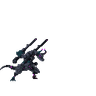 | Decepticleprime | `boss_decepticleprime` | attack (30), breathing (14), death (19), hit (3), idle (13), run (6) |
| 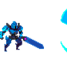 | Decepticlesword | `boss_decepticlesword` | attack (16), breathing (14), death (14), hit (3), idle (13), run (8) |
| 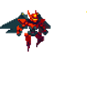 | Decepticlewings | `boss_decepticlewings` | attack (13), breathing (14), death (14), hit (3), idle (12), projectile (3), run (8) |
| 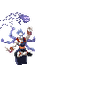 | Dissonance | `boss_dissonance` | attack (20), breathing (14), death (9), hit (3), idle (16), run (8) |
| 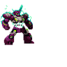 | Emp | `boss_emp` | attack (26), breathing (12), death (9), hit (3), idle (14), run (8) |
| 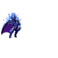 | Gol | `boss_gol` | attack (29), breathing (14), death (28), hit (3), idle (18), run (6) |
| 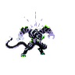 | Grym | `boss_grym` | attack (20), breathing (14), death (20), hit (3), idle (14), run (8) |
| 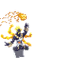 | Harmony | `boss_harmony` | attack (20), breathing (14), death (9), hit (3), idle (16), run (8) |
| 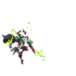 | Invader | `boss_invader` | attack (35), breathing (14), death (24), hit (3), idle (20), run (8) |
| 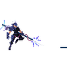 | Kane | `boss_kane` | attack (25), breathing (12), death (16), hit (3), idle (12), run (8) |
| 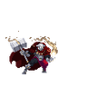 | Kron | `boss_kron` | attack (23), breathing (14), death (15), hit (3), idle (15), run (8) |
| 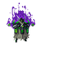 | Legion | `boss_legion` | attack (26), breathing (14), death (17), hit (3), idle (11), run (8) |
| 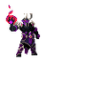 | Malyk | `boss_malyk` | attack (21), breathing (14), death (15), hit (3), idle (22), run (8) |
| 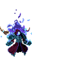 | Manaman | `boss_manaman` | attack (35), breathing (12), death (27), hit (5), idle (8), run (6) |
| 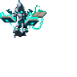 | Orias | `boss_orias` | attack (29), breathing (11), death (22), hit (3), idle (11), run (8) |
| 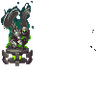 | Oriasidol | `boss_oriasidol` | attack (23), breathing (14), death (15), hit (3), idle (10), run (10) |
| 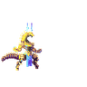 | Paragon | `boss_paragon` | attack (25), breathing (14), death (14), hit (3), idle (16), run (6) |
| 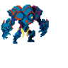 | Protector | `boss_protector` | attack (18), breathing (14), death (9), hit (3), idle (18), run (8) |
| 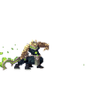 | Sandpanther | `boss_sandpanther` | attack (26), breathing (14), death (16), hit (3), idle (14), run (8) |
| 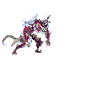 | Serpenti | `boss_serpenti` | attack (22), breathing (14), death (16), hit (3), idle (14), run (8) |
| 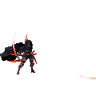 | Shadowlord | `boss_shadowlord` | attack (23), breathing (14), death (20), hit (3), idle (16), run (8) |
|  | Shinkagezendo | `boss_shinkagezendo` | attack (38), breathing (14), death (15), hit (3), idle (14), run (6) |
| 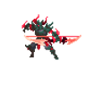 | Skurge | `boss_skurge` | attack (14), breathing (14), death (9), hit (3), idle (11), projectile (4), run (8) |
| 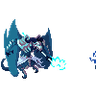 | Skyfalltyrant | `boss_skyfalltyrant` | attack (32), breathing (14), death (11), hit (3), idle (8), run (8) |
| 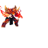 | Solfist | `boss_solfist` | attack (41), breathing (12), death (25), hit (3), idle (12), run (8) |
| 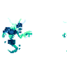 | Soulstealer | `boss_soulstealer` | attack (14), breathing (14), death (16), hit (3), idle (14), run (8) |
| 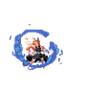 | Spelleater | `boss_spelleater` | attack (19), breathing (14), death (17), hit (3), idle (14), run (8) |
| 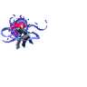 | Taskmaster | `boss_taskmaster` | attack (27), breathing (14), death (19), hit (3), idle (17), run (8) |
| 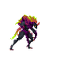 | Treatdemon | `boss_treatdemon` | attack (22), breathing (14), death (15), hit (3), idle (8), run (8) |
| 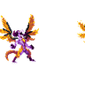 | Treatdrake | `boss_treatdrake` | attack (21), breathing (14), death (17), hit (3), idle (14), run (8) |
| 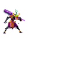 | Treatoni | `boss_treatoni` | attack (32), breathing (14), death (19), hit (3), idle (14), run (8) |
| 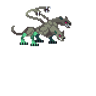 | Umbra | `boss_umbra` | attack (22), breathing (10), death (10), hit (3), idle (10), run (8) |
| 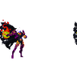 | Unhallowed | `boss_unhallowed` | attack (26), breathing (14), death (15), hit (3), idle (14), run (8) |
| 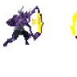 | Valiant | `boss_valiant` | attack (12), breathing (14), death (9), hit (3), idle (11), run (8) |
| 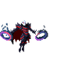 | Vampire | `boss_vampire` | attack (39), breathing (14), death (16), hit (3), idle (22), projectile (3), run (8) |
| 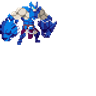 | Wolfpunch | `boss_wolfpunch` | attack (13), breathing (14), death (12), hit (3), idle (14), run (8) |
| 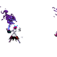 | Wraith | `boss_wraith` | attack (16), breathing (14), death (16), hit (3), idle (14), run (8) |
| 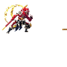 | Wujin | `boss_wujin` | attack (32), breathing (14), death (31), hit (3), idle (18), run (8) |
