# Lyonar Kingdoms

60 units with a complete animation set (`idle`, `attack`, `death`).

Sprites: `public/resources/units/{id}.png` + `{id}_atlas.json` (CC0, open-duelyst).

| Sprite | Name | Id | Animations |
| --- | --- | --- | --- |
| 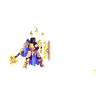 | 3rdgeneral | `f1_3rdgeneral` | attack (32), breathing (14), castend (7), castendsample (56), castloop (4), caststart (7), death (12), hit (3), idle (16), run (10) |
| 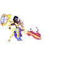 | Altgeneral | `f1_altgeneral` | attack (33), breathing (14), cast (14), castend (4), castloop (6), caststart (10), death (14), hit (3), idle (14), run (8) |
| 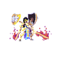 | Altgeneraltier2 | `f1_altgeneraltier2` | attack (28), breathing (14), cast (12), castend (5), castloop (6), caststart (6), death (18), hit (3), idle (16), run (8) |
|  | Archdeacon | `f1_archdeacon` | attack (26), breathing (14), death (17), hit (3), idle (12), run (11) |
| 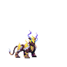 | Auroralioness | `f1_auroralioness` | attack (30), breathing (14), death (13), hit (3), idle (8), run (7) |
| 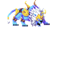 | Azuritelion | `f1_azuritelion` | attack (10), breathing (14), death (16), hit (3), idle (14), run (8) |
| 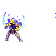 | Baastchampion | `f1_baastchampion` | attack (23), breathing (14), death (17), hit (3), idle (12), run (8) |
| 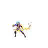 | Backlinearcher | `f1_backlinearcher` | attack (24), breathing (14), death (15), hit (3), idle (12), projectile (3), run (8) |
| 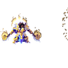 | Bromemk2 | `f1_bromemk2` | attack (28), breathing (14), cast (10), castend (6), castloop (8), caststart (7), death (14), hit (3), idle (10), run (10) |
| 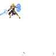 | Buildcommon | `f1_buildcommon` | attack (24), breathing (14), death (16), hit (3), idle (16), run (8) |
| 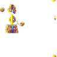 | Buildminion | `f1_buildminion` | attack (20), breathing (14), death (22), hit (3), idle (14) |
|  | Caliber-O | `f1_caliber-o` | attack (29), breathing (14), death (16), hit (3), idle (13), run (10) |
|  | Caster | `f1_caster` | attack (9), breathing (14), death (9), hit (3), idle (8), run (8) |
| 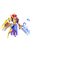 | Elyxstormblade | `f1_elyxstormblade` | attack (12), breathing (14), death (11), hit (3), idle (12), run (8) |
| 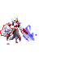 | Elyxstormblademk2 | `f1_elyxstormblademk2` | attack (15), breathing (14), death (10), hit (3), idle (12), run (8) |
|  | Excelsious | `f1_excelsious` | attack (16), breathing (14), death (11), hit (3), idle (13), run (8) |
|  | Fiz | `f1_fiz` | attack (14), breathing (14), death (12), hit (3), idle (15), run (6) |
|  | Friendsguard | `f1_friendsguard` | attack (21), breathing (14), death (14), hit (3), idle (9), run (8) |
| 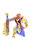 | General | `f1_general` | attack (23), breathing (12), cast (12), castend (3), castloop (4), caststart (9), death (12), hit (3), idle (11), run (8) |
|  | General Skinroguelegacy | `f1_general_skinroguelegacy` | attack (21), breathing (20), cast (12), castend (3), castloop (5), caststart (3), death (26), hit (3), idle (10), run (8) |
|  | Grandmasterzir | `f1_grandmasterzir` | attack (14), breathing (14), death (8), hit (3), idle (14), run (8) |
| 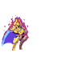 | Groundbreaker | `f1_groundbreaker` | attack (29), breathing (14), death (28), hit (3), idle (18), run (6) |
|  | Gryphinox | `f1_gryphinox` | attack (34), breathing (14), death (14), hit (3), idle (8), run (7) |
|  | Invincibuddy | `f1_invincibuddy` | attack (29), breathing (28), death (20), hit (3), idle (20), run (14) |
|  | Ironcliffeguardian | `f1_ironcliffeguardian` | attack (18), breathing (14), death (9), hit (3), idle (18), run (8) |
| 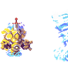 | Ironcliffemonument | `f1_ironcliffemonument` | attack (20), breathing (16), death (11), hit (3), idle (16) |
|  | Kaisergladiator | `f1_kaisergladiator` | attack (30), breathing (16), death (9), hit (3), idle (18), run (6) |
|  | Kingsguard | `f1_kingsguard` | attack (26), breathing (14), death (17), hit (3), idle (27), run (8) |
| 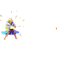 | Leovoyant | `f1_leovoyant` | attack (23), breathing (14), death (17), hit (3), idle (12), run (8) |
|  | Mech | `f1_mech` | attack (24), breathing (14), death (19), hit (3), idle (14), run (10) |
| 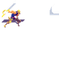 | Melee | `f1_melee` | attack (16), breathing (14), death (7), hit (3), idle (8), run (6) |
| 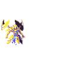 | Peacekeeper | `f1_peacekeeper` | attack (19), breathing (14), death (10), hit (3), idle (14), run (8) |
| 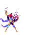 | Peacekeeper2 | `f1_peacekeeper2` | attack (32), breathing (15), death (14), hit (3), idle (13), run (8) |
|  | Radiantdragoon | `f1_radiantdragoon` | attack (25), breathing (12), death (16), hit (3), idle (12), run (8) |
| 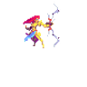 | Ranged | `f1_ranged` | attack (15), breathing (14), death (9), hit (3), idle (10), projectile (5), run (8) |
|  | Rightfulheir | `f1_rightfulheir` | attack (24), breathing (14), death (15), hit (3), idle (14), run (8) |
|  | Scintilla | `f1_scintilla` | attack (39), breathing (14), death (21), hit (3), idle (14), run (8) |
| 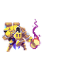 | Shieldforger | `f1_shieldforger` | attack (31), breathing (14), death (12), hit (3), idle (14), run (8) |
|  | Silverguardsquire | `f1_silverguardsquire` | attack (13), breathing (14), death (11), hit (3), idle (10), run (8) |
|  | Silvermanevanguard | `f1_silvermanevanguard` | attack (13), breathing (14), death (12), hit (3), idle (14), run (8) |
| 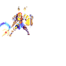 | Sinergyunit | `f1_sinergyunit` | attack (23), breathing (14), death (16), hit (3), idle (14), run (10) |
|  | Sister | `f1_sister` | attack (29), breathing (12), death (19), hit (3), idle (12), run (8) |
|  | Slo | `f1_slo` | attack (15), breathing (14), death (18), hit (3), idle (13), run (6) |
| 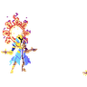 | Solarius | `f1_solarius` | attack (29), breathing (12), death (23), hit (3), idle (12), run (8) |
|  | Solpontiff | `f1_solpontiff` | attack (22), breathing (14), death (17), hit (3), idle (12), run (8) |
| 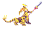 | Special | `f1_special` | attack (15), breathing (14), death (11), hit (3), idle (8), run (8) |
|  | Spellbladeadept | `f1_spellbladeadept` | attack (34), breathing (14), death (20), hit (3), idle (10), run (8) |
| 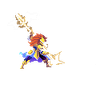 | Sunbreaker | `f1_sunbreaker` | attack (19), breathing (14), death (14), hit (3), idle (12), run (8) |
|  | Sunbreakguardian | `f1_sunbreakguardian` | attack (28), breathing (14), death (22), hit (3), idle (14), run (9) |
| 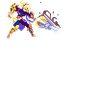 | Sunforgelancer | `f1_sunforgelancer` | attack (26), breathing (14), death (19), hit (3), idle (13), run (8) |
|  | Sunriser | `f1_sunriser` | attack (14), breathing (11), death (11), hit (3), idle (9), run (8) |
| 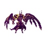 | Sunstonemaiden | `f1_sunstonemaiden` | attack (13), breathing (13), death (10), hit (3), idle (10), run (8) |
| 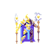 | Sunstonetemplar | `f1_sunstonetemplar` | attack (19), breathing (14), death (12), hit (3), idle (10), run (8) |
|  | Sunwisp | `f1_sunwisp` | attack (25), breathing (14), death (27), hit (3), idle (10), run (10) |
| 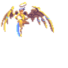 | Support | `f1_support` | attack (7), breathing (14), death (8), hit (3), idle (10), run (5) |
|  | Tank | `f1_tank` | attack (19), breathing (14), death (12), hit (5), idle (11), run (8) |
|  | Tier2general | `f1_tier2general` | attack (40), breathing (12), cast (14), castend (4), castloop (6), caststart (10), death (16), hit (3), idle (12), run (8) |
| 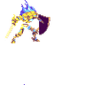 | Warblade | `f1_warblade` | attack (19), breathing (14), death (9), hit (3), idle (12), run (8) |
| 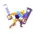 | Windbladecommander | `f1_windbladecommander` | attack (11), breathing (14), death (9), hit (3), idle (10), run (8) |
| 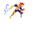 | Xylestormblade | `f1_xylestormblade` | attack (10), breathing (12), death (12), hit (4), idle (8), run (6) |
