# Magmar Aspects

58 units with a complete animation set (`idle`, `attack`, `death`).

Sprites: `public/resources/units/{id}.png` + `{id}_atlas.json` (CC0, open-duelyst).

| Sprite | Name | Id | Animations |
| --- | --- | --- | --- |
|  | 3rdgeneral | `f5_3rdgeneral` | attack (18), breathing (14), cast (14), castend (3), castloop (14), caststart (3), death (17), hit (3), idle (14), run (8) |
|  | Altgeneral | `f5_altgeneral` | attack (19), breathing (14), castend (3), casting (14), castloop (8), caststart (3), death (14), hit (3), idle (14), run (8) |
| 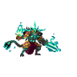 | Altgeneraltier2 | `f5_altgeneraltier2` | attack (35), breathing (14), cast (11), castend (3), castloop (8), caststart (3), death (19), hit (3), idle (12), run (8) |
| 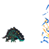 | Ankylos | `f5_ankylos` | attack (35), breathing (20), death (16), hit (3), idle (24), run (10) |
| 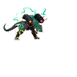 | Armada | `f5_armada` | attack (21), breathing (14), death (10), hit (3), idle (14), run (10) |
| 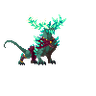 | Brundlbeast | `f5_brundlbeast` | attack (23), breathing (14), death (30), hit (3), idle (14), run (8) |
| 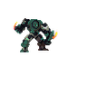 | Buildcommon | `f5_buildcommon` | attack (34), breathing (14), death (17), hit (3), idle (18), run (6) |
| 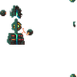 | Buildminion | `f5_buildminion` | attack (20), breathing (14), death (22), hit (3), idle (14) |
| 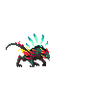 | Catalystquillbeast | `f5_catalystquillbeast` | attack (31), breathing (14), death (25), hit (3), idle (21), run (6) |
| 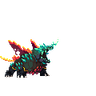 | Dreadnaught | `f5_dreadnaught` | attack (26), breathing (14), death (21), hit (3), idle (16), run (8) |
| 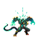 | Drogon | `f5_drogon` | attack (20), breathing (14), death (20), hit (3), idle (14), run (8) |
| 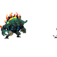 | Earthwalker | `f5_earthwalker` | attack (28), breathing (14), death (23), hit (3), idle (13), run (8) |
| 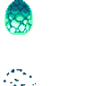 | Egg | `f5_egg` | attack (12), breathing (9), death (7), hit (3), idle (11), open (15) |
|  | Firebreather | `f5_firebreather` | attack (24), breathing (14), death (13), hit (3), idle (12), projectile (3), run (8) |
| 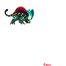 | Flumposaur | `f5_flumposaur` | attack (26), breathing (12), death (10), hit (3), idle (12), run (8) |
| 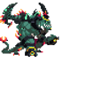 | General | `f5_general` | attack (17), breathing (14), cast (13), castend (4), castloop (4), caststart (4), death (13), hit (3), idle (12), run (8) |
| 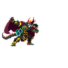 | Genesis | `f5_genesis` | attack (31), breathing (14), death (12), hit (3), idle (8), run (8) |
| 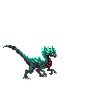 | Gibblegup | `f5_gibblegup` | attack (14), breathing (14), death (13), hit (3), idle (16), run (6) |
| 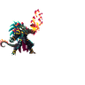 | Grandmasterkraigon | `f5_grandmasterkraigon` | attack (33), breathing (14), death (18), hit (3), idle (20), run (10) |
| 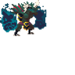 | Grimrock | `f5_grimrock` | attack (16), breathing (12), death (7), hit (3), idle (12), run (12) |
|  | Gro | `f5_gro` | attack (24), breathing (14), death (13), hit (3), idle (16), run (8) |
| 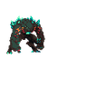 | Juggernaut | `f5_juggernaut` | attack (23), breathing (14), death (16), hit (3), idle (14), run (10) |
| 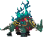 | Kolossus | `f5_kolossus` | attack (19), breathing (14), death (16), hit (3), idle (18), run (6) |
| 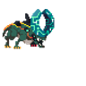 | Kujata | `f5_kujata` | attack (26), breathing (14), death (17), hit (3), idle (16), run (8) |
| 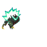 | Lavalasher | `f5_lavalasher` | attack (26), breathing (14), death (12), hit (3), idle (10), run (7) |
| 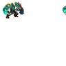 | Magma | `f5_magma` | attack (12), breathing (14), death (17), hit (3), idle (13), run (8) |
| 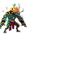 | Mandrake | `f5_mandrake` | attack (34), breathing (14), death (15), hit (3), idle (15), run (8) |
| 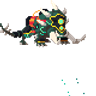 | Mankatorwarbeast | `f5_mankatorwarbeast` | attack (11), breathing (14), death (8), hit (3), idle (11), run (6) |
| 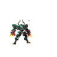 | Mech | `f5_mech` | attack (20), breathing (14), death (17), hit (3), idle (12), run (8) |
| 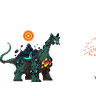 | Megabrontodon | `f5_megabrontodon` | attack (20), breathing (14), death (17), hit (3), idle (14), run (10) |
| 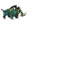 | Minibeast | `f5_minibeast` | attack (24), breathing (14), death (16), hit (3), idle (22), run (8) |
| 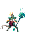 | Molokihuntress | `f5_molokihuntress` | attack (22), breathing (14), death (15), hit (3), idle (14), run (8) |
|  | Mythronquest | `f5_mythronquest` | attack (23), breathing (14), death (20), hit (3), idle (10), run (10) |
| 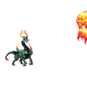 | Omniseer | `f5_omniseer` | attack (23), breathing (14), death (8), hit (3), idle (14), run (8) |
| 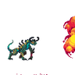 | Oxalaia | `f5_oxalaia` | attack (29), breathing (16), death (15), hit (3), idle (21), run (8) |
|  | Primordialgazer | `f5_primordialgazer` | attack (16), breathing (12), death (8), hit (3), idle (12), run (8) |
| 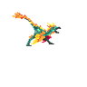 | Pteryx | `f5_pteryx` | attack (22), breathing (14), death (18), hit (3), idle (9), run (8) |
| 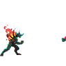 | Ragebinder | `f5_ragebinder` | attack (23), breathing (14), death (16), hit (3), idle (14), run (8) |
| 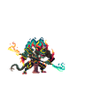 | Ragnoramk2 | `f5_ragnoramk2` | attack (36), breathing (14), cast (13), castend (5), castloop (5), caststart (5), death (15), hit (3), idle (14), run (8) |
| 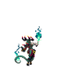 | Rancour | `f5_rancour` | attack (43), breathing (14), death (27), hit (3), idle (17), run (8) |
| 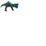 | Rex | `f5_rex` | attack (34), breathing (14), death (12), hit (3), idle (12), run (8) |
| 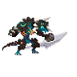 | Silitharelder | `f5_silitharelder` | attack (14), breathing (14), death (15), hit (3), idle (14), run (8) |
| 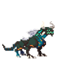 | Silitharveteran | `f5_silitharveteran` | attack (25), breathing (14), death (14), hit (3), idle (16), run (8) |
| 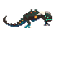 | Silitharyoung | `f5_silitharyoung` | attack (8), breathing (15), death (11), hit (4), idle (8), move (8) |
| 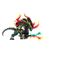 | Sinergyunit | `f5_sinergyunit` | attack (18), breathing (16), death (15), hit (3), idle (16), run (8) |
|  | Sister | `f5_sister` | attack (32), breathing (12), death (21), hit (3), idle (12), run (8) |
| 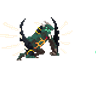 | Spiritharvester | `f5_spiritharvester` | attack (19), breathing (14), death (15), hit (3), idle (14), run (8) |
| 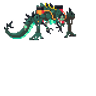 | Support | `f5_support` | attack (14), breathing (14), death (9), hit (3), idle (12), run (8) |
| 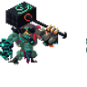 | Tank | `f5_tank` | attack (12), breathing (14), death (10), hit (3), idle (14), run (8) |
| 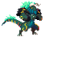 | Thraex | `f5_thraex` | attack (25), breathing (14), death (21), hit (3), idle (11), run (8) |
| 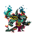 | Tier2general | `f5_tier2general` | attack (34), breathing (14), cast (17), castend (4), castloop (4), caststart (4), death (22), hit (3), idle (19), run (8) |
|  | Unstableflump | `f5_unstableflump` | attack (28), breathing (20), death (21), hit (3), idle (18), run (10) |
| 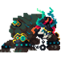 | Unstableleviathan | `f5_unstableleviathan` | attack (28), breathing (12), death (14), hit (3), idle (12), run (8) |
| 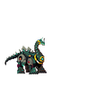 | Upgradizon | `f5_upgradizon` | attack (29), breathing (14), death (18), hit (3), idle (14), run (8) |
| 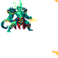 | Valknu | `f5_valknu` | attack (14), breathing (14), death (14), hit (3), idle (16), run (8) |
| 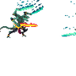 | Vindicator | `f5_vindicator` | attack (29), breathing (14), death (17), hit (3), idle (14), run (8) |
| 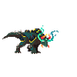 | Visionar | `f5_visionar` | attack (29), breathing (14), death (17), hit (3), idle (12), run (8) |
|  | Wildinceptor | `f5_wildinceptor` | attack (33), breathing (14), death (35), hit (3), idle (14), run (14) |
