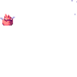
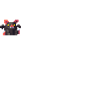

# Misc (critters, props)

2 units with a complete animation set (`idle`, `attack`, `death`).

Sprites: `public/resources/units/{id}.png` + `{id}_atlas.json` (CC0, open-duelyst).

| Sprite | Name | Id | Animations |
| --- | --- | --- | --- |
|  | Critter 1 | `critter_1` | attack (14), breathing (14), death (6), hit (3), idle (8), run (6) |
|  | Critter 2 | `critter_2` | attack (11), breathing (14), death (6), hit (3), idle (8), run (4) |
