# Neutral

276 units with a complete animation set (`idle`, `attack`, `death`).

Sprites: `public/resources/units/{id}.png` + `{id}_atlas.json` (CC0, open-duelyst).

| Sprite | Name | Id | Animations |
| --- | --- | --- | --- |
| 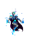 | Abjudicator | `neutral_abjudicator` | attack (24), breathing (14), death (17), hit (3), idle (16), run (8) |
| 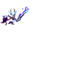 | Aer | `neutral_aer` | attack (26), breathing (14), death (14), hit (3), idle (12), run (8) |
|  | Aethermaster | `neutral_aethermaster` | attack (26), breathing (14), death (18), hit (3), idle (12), run (6) |
|  | Alterrexx | `neutral_alterrexx` | attack (30), breathing (14), death (19), hit (3), idle (13), run (6) |
| 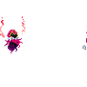 | Amu | `neutral_amu` | attack (25), breathing (14), death (19), hit (3), idle (14), run (8) |
| 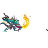 | Arakiheadhunter | `neutral_arakiheadhunter` | attack (30), breathing (14), death (14), hit (3), idle (14), run (8) |
| 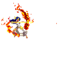 | Arrowwhistler | `neutral_arrowwhistler` | attack (31), breathing (14), death (20), hit (3), idle (18), run (8) |
| 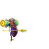 | Artificer | `neutral_artificer` | attack (51), breathing (14), death (13), hit (3), idle (14), run (8) |
| 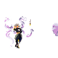 | Artificereshaper | `neutral_artificereshaper` | attack (35), breathing (14), death (13), hit (3), idle (22), run (7) |
| 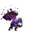 | Ashmephyt | `neutral_ashmephyt` | attack (30), breathing (14), death (22), hit (3), idle (14), run (8) |
| 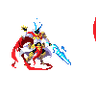 | Astralcrusader | `neutral_astralcrusader` | attack (29), breathing (14), death (12), hit (3), idle (12), run (8) |
| 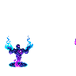 | Astralprime | `neutral_astralprime` | attack (37), breathing (14), death (22), hit (3), idle (21), run (6) |
| 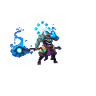 | Azureherald | `neutral_azureherald` | attack (23), breathing (14), death (18), hit (3), idle (14), run (8) |
| 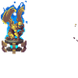 | Bastion | `neutral_bastion` | attack (23), breathing (14), death (15), hit (3), idle (10), run (10) |
|  | Beastcavern | `neutral_beastcavern` | attack (11), breathing (14), death (7), hit (3), idle (12), run (8) |
| 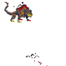 | Beastdarkharbinger | `neutral_beastdarkharbinger` | attack (11), breathing (14), death (11), hit (3), idle (12), run (8) |
| 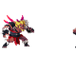 | Beastmaster | `neutral_beastmaster` | attack (22), breathing (14), death (16), hit (3), idle (12), run (8) |
| 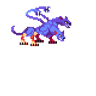 | Beastmirkwooddevourer | `neutral_beastmirkwooddevourer` | attack (22), breathing (10), death (10), hit (3), idle (10), run (8) |
|  | Beastphasehound | `neutral_beastphasehound` | attack (13), breathing (10), death (8), hit (3), idle (10), run (8) |
| 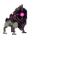 | Beastrepulsion | `neutral_beastrepulsion` | attack (14), breathing (16), death (8), hit (3), idle (12), run (8) |
| 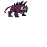 | Beastsaberspinetiger | `neutral_beastsaberspinetiger` | attack (10), breathing (10), death (8), hit (3), idle (10), run (8) |
|  | Beastswamp | `neutral_beastswamp` | attack (12), breathing (14), death (8), hit (3), idle (12), run (10) |
|  | Blacklocust | `neutral_blacklocust` | attack (21), breathing (14), death (16), hit (3), idle (12), run (6) |
| 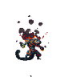 | Blisteringscorn | `neutral_blisteringscorn` | attack (22), breathing (14), death (22), hit (3), idle (14), run (8) |
| 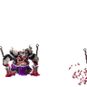 | Bloodletter | `neutral_bloodletter` | attack (40), breathing (14), death (22), hit (3), idle (22), run (8) |
| 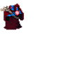 | Bloodstonealchemist | `neutral_bloodstonealchemist` | attack (34), breathing (14), death (19), hit (3), idle (14), run (8) |
| 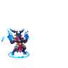 | Blueconjurer | `neutral_blueconjurer` | attack (35), breathing (14), death (8), hit (3), idle (16), run (10) |
| 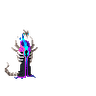 | Bonereaper | `neutral_bonereaper` | attack (22), breathing (14), death (38), hit (3), idle (14), run (8) |
| 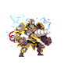 | Boulderbreach | `neutral_boulderbreach` | attack (39), breathing (14), death (30), hit (3), idle (18), run (8) |
| 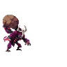 | Boulderhurler | `neutral_boulderhurler` | attack (30), breathing (14), death (16), hit (3), idle (8), run (8) |
| 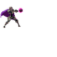 | Buildcommon | `neutral_buildcommon` | attack (31), breathing (14), death (18), hit (3), idle (7), run (8) |
| 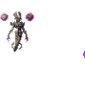 | Buildepic | `neutral_buildepic` | attack (26), breathing (14), death (24), hit (3), idle (18), run (8) |
| 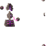 | Buildminion | `neutral_buildminion` | attack (20), breathing (14), death (22), hit (3), idle (14) |
| 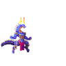 | Calculator | `neutral_calculator` | attack (25), breathing (14), death (14), hit (3), idle (16), run (6) |
|  | Capriciouswarrior | `neutral_capriciouswarrior` | attack (24), breathing (14), death (14), hit (3), idle (14), run (10) |
| 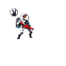 | Captainhankheart | `neutral_captainhankheart` | attack (19), breathing (14), death (23), hit (3), idle (12), projectile (3), run (6) |
|  | Celebrant | `neutral_celebrant` | attack (18), breathing (14), death (10), hit (3), idle (14), run (8) |
| 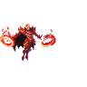 | Chakkram | `neutral_chakkram` | attack (39), breathing (14), death (16), hit (3), idle (22), projectile (3), run (8) |
| 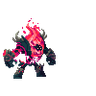 | Chaoselemental | `neutral_chaoselemental` | attack (38), breathing (10), death (35), hit (3), idle (10), run (8) |
| 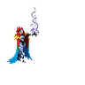 | Chloroara | `neutral_chloroara` | attack (20), breathing (14), death (16), hit (3), idle (14), run (7) |
| 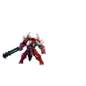 | Contentiousbrute | `neutral_contentiousbrute` | attack (25), breathing (14), death (12), hit (3), idle (22), run (6) |
| 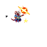 | Crimsonmystic | `neutral_crimsonmystic` | attack (16), breathing (14), death (18), hit (3), idle (18), run (8) |
|  | Critterc | `neutral_critterc` | attack (23), breathing (14), death (14), hit (3), idle (12), run (6) |
| 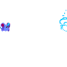 | Critterd | `neutral_critterd` | attack (27), breathing (14), death (19), hit (3), idle (10), run (6) |
| 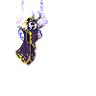 | Cryptographer | `neutral_cryptographer` | attack (24), breathing (15), death (21), hit (3), idle (8), run (8) |
| 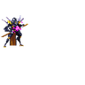 | Dagona | `neutral_dagona` | attack (33), breathing (14), death (17), hit (3), idle (14), run (8) |
| 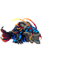 | Dagonafish | `neutral_dagonafish` | attack (20), breathing (16), death (14), hit (3), idle (12), run (10) |
| 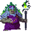 | Darknemesis | `neutral_darknemesis` | attack (16), breathing (14), death (15), hit (3), idle (14), run (8) |
| 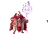 | Daywatcher | `neutral_daywatcher` | attack (20), breathing (14), death (17), hit (3), idle (12), run (8) |
| 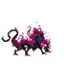 | Deathblighter | `neutral_deathblighter` | attack (19), breathing (14), death (17), hit (3), idle (14), run (8) |
| 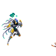 | Deceptib0t | `neutral_deceptib0t` | attack (25), breathing (14), death (21), hit (3), idle (14), run (8) |
| 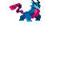 | Dex | `neutral_dex` | attack (15), breathing (14), death (20), hit (3), idle (16), run (8) |
| 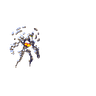 | Diamondgolem | `neutral_diamondgolem` | attack (35), breathing (14), death (23), hit (3), idle (16), run (10) |
|  | Dreamgazer | `neutral_dreamgazer` | attack (27), breathing (14), death (15), hit (4), idle (17), run (8) |
| 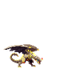 | Dustwailer | `neutral_dustwailer` | attack (36), breathing (14), death (13), hit (3), idle (18), run (7) |
| 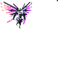 | Eclipse | `neutral_eclipse` | attack (21), breathing (14), death (15), hit (3), idle (14), run (8) |
| 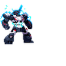 | Emp | `neutral_emp` | attack (26), breathing (12), death (9), hit (3), idle (14), run (8) |
| 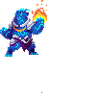 | Envybaer | `neutral_envybaer` | attack (34), breathing (14), death (12), hit (3), idle (16), run (8) |
| 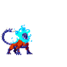 | Exun | `neutral_exun` | attack (23), breathing (12), death (15), hit (3), idle (12), run (8) |
| 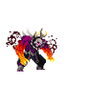 | Feralu | `neutral_feralu` | attack (19), breathing (14), death (14), hit (3), idle (9), run (8) |
|  | Firestarter | `neutral_firestarter` | attack (31), breathing (14), death (13), hit (3), idle (12), run (8) |
|  | Fog | `neutral_fog` | attack (31), breathing (14), death (19), hit (3), idle (16), run (8) |
|  | Gambler | `neutral_gambler` | attack (19), breathing (14), death (23), hit (3), idle (14), projectile (3), run (8) |
|  | Gauntletmaster | `neutral_gauntletmaster` | attack (17), breathing (14), death (18), hit (3), idle (14), run (8) |
|  | Geargrinder | `neutral_geargrinder` | attack (29), breathing (14), death (44), hit (3), idle (16), run (8) |
|  | Ghostlynx | `neutral_ghostlynx` | attack (26), breathing (14), death (18), hit (3), idle (16), run (8) |
|  | Ghoulie | `neutral_ghoulie` | attack (17), breathing (14), death (28), hit (3), idle (14), run (8) |
|  | Giantcrab | `neutral_giantcrab` | attack (54), breathing (14), death (13), hit (3), idle (15), run (8) |
|  | Gnasher | `neutral_gnasher` | attack (15), breathing (14), death (24), hit (3), idle (9), run (6) |
|  | Goldenhammer | `neutral_goldenhammer` | attack (29), breathing (14), death (11), hit (3), idle (14), run (6) |
|  | Goldenjusticar | `neutral_goldenjusticar` | attack (20), breathing (14), death (22), hit (3), idle (16), run (8) |
|  | Goldenmantella | `neutral_goldenmantella` | attack (26), breathing (14), death (13), hit (3), idle (12), run (8) |
|  | Golem Crossbones | `neutral_golem_crossbones` | attack (21), breathing (12), death (21), hit (3), idle (12), movement (8), projectile (3) |
|  | Golembloodshard | `neutral_golembloodshard` | attack (12), breathing (14), death (8), hit (3), idle (14), run (8) |
|  | Golemdragonbone | `neutral_golemdragonbone` | attack (13), breathing (14), death (9), hit (3), idle (14), run (8) |
|  | Golemice | `neutral_golemice` | attack (10), breathing (14), death (9), hit (3), idle (13), run (8) |
|  | Golemnature | `neutral_golemnature` | attack (8), breathing (14), death (9), hit (3), idle (12), run (8) |
|  | Golemrunesand | `neutral_golemrunesand` | attack (12), breathing (14), death (9), hit (3), idle (14), run (8) |
|  | Golemsteel | `neutral_golemsteel` | attack (10), breathing (14), death (13), hit (3), idle (14), run (6) |
|  | Golemstone | `neutral_golemstone` | attack (13), breathing (14), death (13), hit (3), idle (14), run (8) |
|  | Golemstormmetal | `neutral_golemstormmetal` | attack (14), breathing (14), death (10), hit (3), idle (14), run (8) |
|  | Grablackhole | `neutral_grablackhole` | attack (44), breathing (14), death (26), hit (3), idle (18), run (6) |
|  | Grimes | `neutral_grimes` | attack (24), breathing (14), death (16), hit (3), idle (8), run (8) |
|  | Grincher | `neutral_grincher` | attack (27), breathing (14), death (14), hit (3), idle (8), run (8) |
|  | Gro | `neutral_gro` | attack (24), breathing (14), death (13), hit (3), idle (16), run (8) |
|  | Hatred | `neutral_hatred` | attack (23), breathing (14), death (19), hit (3), idle (16), run (6) |
|  | Healingmystic | `neutral_healingmystic` | attack (16), breathing (14), death (15), hit (3), idle (14), run (8) |
|  | Healingmysticbandainamco | `neutral_healingmysticbandainamco` | attack (16), breathing (14), death (15), hit (3), idle (14), run (8) |
|  | Healingmystictwitch | `neutral_healingmystictwitch` | attack (16), breathing (14), death (15), hit (3), idle (14), run (8) |
|  | Highhand | `neutral_highhand` | attack (21), breathing (14), death (15), hit (3), idle (22), run (8) |
|  | Hollowgrovekeeper | `neutral_hollowgrovekeeper` | attack (40), breathing (14), death (11), hit (3), idle (20), run (8) |
|  | Hsuku | `neutral_hsuku` | attack (24), breathing (14), death (20), hit (3), idle (28), run (8) |
|  | Hydrax | `neutral_hydrax` | attack (24), breathing (14), death (18), hit (3), idle (16), run (8) |
|  | Incindy | `neutral_incindy` | attack (21), breathing (14), death (13), hit (3), idle (12), run (8) |
|  | Inquisitorkron | `neutral_inquisitorkron` | attack (23), breathing (14), death (15), hit (3), idle (15), run (8) |
|  | Ion | `neutral_ion` | attack (19), attack_projectile (6), breathing (14), death (15), hit (3), idle (8), run (8) |
|  | Ironclad | `neutral_ironclad` | attack (39), breathing (14), death (25), hit (3), idle (16), run (10) |
|  | Jaxi | `neutral_jaxi` | attack (23), breathing (14), death (37), hit (3), idle (13), run (6) |
|  | Jaxtruesight | `neutral_jaxtruesight` | attack (21), breathing (14), death (17), hit (3), idle (14), projectile (4), run (8) |
|  | Keeperofthevale | `neutral_keeperofthevale` | attack (24), breathing (14), death (20), hit (3), idle (10), run (6) |
|  | Keeperofthevalue | `neutral_keeperofthevalue` | attack (24), breathing (14), death (20), hit (3), idle (10), run (6) |
|  | Khymera | `neutral_khymera` | attack (24), breathing (18), death (18), hit (3), idle (18), run (10) |
|  | Kin | `neutral_kin` | attack (32), breathing (14), death (14), hit (4), idle (16), run (8) |
|  | Koi | `neutral_koi` | attack (23), breathing (14), death (18), hit (3), idle (18), run (8) |
|  | Komodokin | `neutral_komodokin` | attack (31), breathing (14), death (12), hit (3), idle (10), run (8) |
|  | Ladylocke | `neutral_ladylocke` | attack (23), breathing (14), death (15), hit (3), idle (14), run (8) |
|  | Letigress | `neutral_letigress` | attack (24), breathing (14), death (14), hit (3), idle (14), projectile (3), run (8) |
|  | Letigresscub | `neutral_letigresscub` | attack (22), breathing (14), death (18), hit (3), idle (24), run (8) |
|  | Loreweaver | `neutral_loreweaver` | attack (28), breathing (14), death (21), hit (3), idle (8), run (8) |
|  | Luxignis | `neutral_luxignis` | attack (36), breathing (14), death (14), hit (3), idle (17), projectile (3), run (8) |
|  | Mageswarm | `neutral_mageswarm` | attack (28), breathing (14), death (9), hit (3), idle (14), run (8) |
|  | Masteroftheseven | `neutral_masteroftheseven` | attack (17), breathing (14), death (23), hit (3), idle (14), run (8) |
|  | Maw | `neutral_maw` | attack (15), breathing (14), death (8), hit (3), idle (12), run (8) |
|  | Mechaz0rcannon | `neutral_mechaz0rcannon` | attack (13), breathing (14), death (10), hit (3), idle (11), projectile (3), run (8) |
|  | Mechaz0rchassis | `neutral_mechaz0rchassis` | attack (12), breathing (14), death (13), hit (3), idle (12), run (8) |
|  | Mechaz0rhelm | `neutral_mechaz0rhelm` | attack (11), breathing (14), death (13), hit (3), idle (11), run (6) |
|  | Mechaz0rsuper | `neutral_mechaz0rsuper` | attack (25), breathing (14), death (19), hit (3), idle (14), projectile (3), run (6) |
|  | Mechaz0rsword | `neutral_mechaz0rsword` | attack (16), breathing (14), death (14), hit (3), idle (13), run (8) |
|  | Mechaz0rwing | `neutral_mechaz0rwing` | attack (13), breathing (14), death (14), hit (3), idle (12), projectile (3), run (8) |
|  | Meltdown | `neutral_meltdown` | attack (22), breathing (14), death (16), hit (3), idle (14), run (8) |
|  | Mercarcanelimiter | `neutral_mercarcanelimiter` | attack (21), breathing (16), death (10), hit (3), idle (16), run (8) |
|  | Mercarchonspellbinder | `neutral_mercarchonspellbinder` | attack (29), breathing (11), death (22), hit (3), idle (11), run (8) |
|  | Mercazurehorn | `neutral_mercazurehorn` | attack (12), breathing (12), death (16), hit (5), idle (12), run (8) |
|  | Merccaster1 | `neutral_merccaster1` | attack (8), breathing (14), death (10), hit (3), idle (12), run (6) |
|  | Mercdaggerkiri | `neutral_mercdaggerkiri` | attack (16), breathing (14), death (13), hit (3), idle (13), run (8) |
|  | Mercflamebloodwarlock | `neutral_mercflamebloodwarlock` | attack (22), breathing (12), death (16), hit (3), idle (12), projectile (3), run (8) |
|  | Mercfrostbonenaga | `neutral_mercfrostbonenaga` | attack (18), breathing (14), death (16), hit (3), idle (15), run (8) |
|  | Mercgambitgirl | `neutral_mercgambitgirl` | attack (15), breathing (12), death (11), hit (3), idle (12), run (8) |
|  | Mercgrenadier | `neutral_mercgrenadier` | attack (9), breathing (14), death (10), hit (3), idle (12), projectile (4), run (8) |
|  | Mercmelee1 | `neutral_mercmelee1` | attack (6), breathing (14), death (9), hit (3), idle (8), run (6) |
|  | Mercmelee2 | `neutral_mercmelee2` | attack (7), breathing (14), death (10), hit (3), idle (8), run (6) |
|  | Mercmelee3 | `neutral_mercmelee3` | attack (8), breathing (14), death (7), hit (3), idle (10), run (6) |
|  | Mercmelee4 | `neutral_mercmelee4` | attack (5), breathing (14), death (9), hit (3), idle (9), run (6) |
|  | Mercmindwarper | `neutral_mercmindwarper` | attack (18), breathing (16), death (17), hit (3), idle (16), run (8) |
|  | Mercneedler | `neutral_mercneedler` | attack (11), breathing (14), death (10), hit (3), idle (11), run (8) |
|  | Mercowlbearmage | `neutral_mercowlbearmage` | attack (11), breathing (14), death (11), hit (3), idle (14), run (8) |
|  | Mercpirate | `neutral_mercpirate` | attack (12), breathing (14), death (9), hit (3), idle (15), run (8) |
|  | Mercpiratebeast | `neutral_mercpiratebeast` | attack (12), breathing (12), death (8), hit (3), idle (6), run (6) |
|  | Mercranged1 | `neutral_mercranged1` | attack (8), breathing (14), death (10), hit (3), idle (8), projectile (3), run (6) |
|  | Mercshieldoracle | `neutral_mercshieldoracle` | attack (20), breathing (13), death (20), hit (3), idle (11), run (6) |
|  | Mercsightlessfarseer | `neutral_mercsightlessfarseer` | attack (31), breathing (14), death (15), hit (3), idle (16), run (8) |
|  | Mercsongweaver | `neutral_mercsongweaver` | attack (14), breathing (12), death (9), hit (3), idle (12), run (6) |
|  | Mercsunseer | `neutral_mercsunseer` | attack (23), breathing (14), death (16), hit (3), idle (12), run (8) |
|  | Mercswornavanger | `neutral_mercswornavanger` | attack (14), breathing (14), death (9), hit (3), idle (11), projectile (4), run (8) |
|  | Mercsworndefender | `neutral_mercsworndefender` | attack (12), breathing (14), death (9), hit (3), idle (11), run (8) |
|  | Merctwilightmage | `neutral_merctwilightmage` | attack (10), breathing (15), death (9), hit (3), idle (14), run (8) |
|  | Merctwinbladewarmonger | `neutral_merctwinbladewarmonger` | attack (10), breathing (14), death (8), hit (3), idle (13), run (8) |
|  | Metaltooth | `neutral_metaltooth` | attack (34), breathing (14), death (25), hit (4), idle (14), run (8) |
|  | Minijax | `neutral_minijax` | attack (25), breathing (14), death (13), hit (3), idle (8), projectile (4), run (8) |
|  | Mirrormancer | `neutral_mirrormancer` | attack (35), breathing (14), death (34), hit (3), idle (14), run (8) |
|  | Moebius | `neutral_moebius` | attack (36), breathing (14), death (19), hit (3), idle (10), run (8) |
|  | Mogwai | `neutral_mogwai` | attack (24), breathing (14), death (14), hit (3), idle (14), run (8) |
|  | Moltengolem | `neutral_moltengolem` | attack (28), breathing (14), death (20), hit (3), idle (16), run (12) |
|  | Monster Explodingdemon | `neutral_monster_explodingdemon` | attack (8), breathing (14), death (7), explode (19), hit (3), idle (12), run (8) |
|  | Monsterartifacthunter | `neutral_monsterartifacthunter` | attack (19), breathing (12), death (11), hit (3), idle (10), run (8) |
|  | Monsterblacksandburrower | `neutral_monsterblacksandburrower` | attack (14), breathing (14), death (8), hit (3), idle (14), run (6) |
|  | Monstercoiledcrawler | `neutral_monstercoiledcrawler` | attack (11), breathing (12), death (16), hit (3), idle (10), run (9) |
|  | Monstercrystalwisp | `neutral_monstercrystalwisp` | attack (18), breathing (15), death (11), hit (3), idle (12), run (6) |
|  | Monsterdancingblades | `neutral_monsterdancingblades` | attack (35), breathing (14), death (20), hit (3), idle (14), run (8) |
|  | Monsterdarkharbinger | `neutral_monsterdarkharbinger` | attack (11), breathing (16), death (10), hit (3), idle (12), run (8) |
|  | Monsterdragonhawk | `neutral_monsterdragonhawk` | attack (11), breathing (14), death (9), hit (3), idle (14), run (7) |
|  | Monsterdreamoracle | `neutral_monsterdreamoracle` | attack (9), breathing (10), death (9), hit (3), idle (10), run (10) |
|  | Monsterexplodingdemon | `neutral_monsterexplodingdemon` | attack (19), breathing (14), death (7), explode (19), hit (3), idle (12), run (8) |
|  | Monsterflamewing | `neutral_monsterflamewing` | attack (14), breathing (15), death (10), hit (3), idle (10), run (8) |
|  | Monsterlightningbeetle | `neutral_monsterlightningbeetle` | attack (25), breathing (14), death (8), hit (3), idle (12), run (12) |
|  | Monsteroculus | `neutral_monsteroculus` | attack (9), breathing (14), death (9), hit (3), idle (10), run (10) |
|  | Monsteronyxscorpion | `neutral_monsteronyxscorpion` | attack (12), breathing (14), death (11), hit (3), idle (14), run (8) |
|  | Monsterputridmindflayer | `neutral_monsterputridmindflayer` | attack (24), breathing (14), death (12), hit (3), idle (14), run (8) |
|  | Monsterredsynja | `neutral_monsterredsynja` | attack (36), breathing (14), death (16), hit (3), idle (16), run (8) |
|  | Monstershreddingmantis | `neutral_monstershreddingmantis` | attack (12), breathing (12), death (11), hit (3), idle (13), run (7) |
|  | Monsterwhistlingblade | `neutral_monsterwhistlingblade` | attack (12), breathing (14), death (8), hit (3), idle (14), run (8) |
|  | Moonlitsorcerer | `neutral_moonlitsorcerer` | attack (29), breathing (14), death (25), hit (3), idle (14), run (6) |
|  | Mrgoldmclover | `neutral_mrgoldmclover` | attack (25), breathing (14), death (20), hit (3), idle (31), run (8) |
|  | Mystery | `neutral_mystery` | attack (22), breathing (14), death (17), hit (3), idle (16), run (8) |
|  | Nightwatcher | `neutral_nightwatcher` | attack (26), breathing (14), death (17), hit (3), idle (11), run (8) |
|  | Nip | `neutral_nip` | attack (48), breathing (14), death (17), hit (3), idle (12), run (8) |
|  | Oni | `neutral_oni` | attack (21), breathing (14), death (19), hit (3), idle (14), run (8) |
|  | Owlshadescholar | `neutral_owlshadescholar` | attack (14), breathing (14), death (15), hit (3), idle (15), run (8) |
|  | Paddo | `neutral_paddo` | attack (34), breathing (14), death (21), hit (3), idle (18), run (8) |
|  | Pandora | `neutral_pandora` | attack (23), breathing (10), death (13), hit (3), idle (10), run (8) |
|  | Pandoraminioncelerity | `neutral_pandoraminioncelerity` | attack (20), breathing (14), death (16), hit (3), idle (12), run (8) |
|  | Pandoraminionfly | `neutral_pandoraminionfly` | attack (20), breathing (14), death (16), hit (3), idle (12), run (6) |
|  | Pandoraminionfrenzy | `neutral_pandoraminionfrenzy` | attack (20), breathing (14), death (16), hit (3), idle (12), run (8) |
|  | Pandoraminionprovoke | `neutral_pandoraminionprovoke` | attack (20), breathing (14), death (16), hit (3), idle (12), run (8) |
|  | Pandoraminionrush | `neutral_pandoraminionrush` | attack (20), breathing (14), death (16), hit (3), idle (12), run (8) |
|  | Partyelf | `neutral_partyelf` | attack (25), breathing (14), death (23), hit (3), idle (14), run (8) |
|  | Pennyarcade01 | `neutral_pennyarcade01` | attack (28), breathing (14), death (25), hit (3), idle (12), run (6) |
|  | Pennyarcade02 | `neutral_pennyarcade02` | attack (19), breathing (16), death (20), hit (3), idle (15), run (8) |
|  | Pennyarcade03 | `neutral_pennyarcade03` | attack (34), breathing (14), death (32), hit (3), idle (22), run (8) |
|  | Pennyarcade04 | `neutral_pennyarcade04` | attack (20), breathing (14), death (28), hit (3), idle (19), run (8) |
|  | Primusshieldmaster | `neutral_primusshieldmaster` | attack (18), breathing (14), death (24), hit (3), idle (12), run (8) |
|  | Prismaticillusionist | `neutral_prismaticillusionist` | attack (13), breathing (14), death (10), hit (3), idle (14), run (8) |
|  | Prismaticillusionistminion | `neutral_prismaticillusionistminion` | attack (13), breathing (14), death (14), hit (3), idle (14), run (8) |
|  | Prongbok | `neutral_prongbok` | attack (22), breathing (14), death (10), hit (3), idle (27), run (6) |
|  | Prophetwhitepalm | `neutral_prophetwhitepalm` | attack (34), breathing (14), death (19), hit (3), idle (18), run (8) |
|  | Purgatos | `neutral_purgatos` | attack (23), breathing (15), death (17), hit (3), idle (14), run (8) |
|  | Quahog | `neutral_quahog` | attack (19), breathing (13), death (15), hit (3), idle (14), run (8) |
|  | Quartermastergauj | `neutral_quartermastergauj` | attack (23), breathing (14), death (20), hit (3), idle (16), run (8) |
|  | Rawr | `neutral_rawr` | attack (26), breathing (14), death (27), hit (3), idle (12), run (7) |
|  | Razorcraggolem | `neutral_razorcraggolem` | attack (19), breathing (14), death (14), hit (3), idle (16), run (8) |
|  | Rejuvenator | `neutral_rejuvenator` | attack (25), breathing (14), death (22), hit (3), idle (14), run (8) |
|  | Replicator | `neutral_replicator` | attack (26), breathing (14), death (24), hit (3), idle (14), run (6) |
|  | Rok | `neutral_rok` | attack (27), breathing (12), death (12), hit (3), idle (12), run (8) |
|  | Rook | `neutral_rook` | attack (23), breathing (14), death (15), hit (3), idle (14), run (8) |
|  | Rubyrifter | `neutral_rubyrifter` | attack (31), breathing (14), death (13), hit (3), idle (18), run (8) |
|  | Saberspinemk2 | `neutral_saberspinemk2` | attack (10), breathing (10), death (8), hit (3), idle (10), run (8) |
|  | Sai | `neutral_sai` | attack (24), breathing (14), death (21), hit (3), idle (12), run (8) |
|  | Sapphireseer | `neutral_sapphireseer` | attack (25), breathing (14), death (19), hit (3), idle (12), run (6) |
|  | Sarlacmk2 | `neutral_sarlacmk2` | attack (19), breathing (14), death (12), hit (3), idle (10), run (8) |
|  | Scarzig | `neutral_scarzig` | attack (34), breathing (14), death (15), hit (3), idle (9), run (5) |
|  | Serpenti | `neutral_serpenti` | attack (19), breathing (14), death (16), hit (3), idle (17), run (8) |
|  | Shadow1 | `neutral_shadow1` | attack (11), breathing (14), death (8), hit (3), idle (8), run (6) |
|  | Shadow2 | `neutral_shadow2` | attack (10), breathing (14), death (8), hit (3), idle (12), run (6) |
|  | Shadow3 | `neutral_shadow3` | attack (10), breathing (14), death (8), hit (3), idle (10), run (6) |
|  | Shadowcaster | `neutral_shadowcaster` | attack (13), breathing (14), death (11), hit (3), idle (10), run (6) |
|  | Shadowranged | `neutral_shadowranged` | attack (12), breathing (14), death (9), hit (3), idle (12), run (12) |
|  | Shirodogdragon | `neutral_shirodogdragon` | attack (18), breathing (14), death (17), hit (3), idle (16), run (8) |
|  | Shuffler | `neutral_shuffler` | attack (24), breathing (14), death (14), hit (3), idle (48), run (8) |
|  | Silhouettetracer | `neutral_silhouettetracer` | attack (13), breathing (15), death (12), hit (3), idle (9), run (8) |
|  | Silverbeak | `neutral_silverbeak` | attack (19), breathing (14), death (20), hit (3), idle (14), run (8) |
|  | Silvermech | `neutral_silvermech` | attack (32), breathing (14), death (22), hit (3), idle (18), run (8) |
|  | Singletonmythron | `neutral_singletonmythron` | attack (25), breathing (10), death (16), hit (3), idle (20), run (6) |
|  | Sinistersilhouette | `neutral_sinistersilhouette` | attack (28), breathing (14), death (13), hit (3), idle (20), run (8) |
|  | Sister | `neutral_sister` | attack (36), breathing (14), death (18), hit (3), idle (14), run (8) |
|  | Skywing | `neutral_skywing` | attack (24), breathing (14), death (18), hit (3), idle (12), run (8) |
|  | Soboro | `neutral_soboro` | attack (33), breathing (12), death (13), hit (3), idle (12), run (8) |
|  | Sol | `neutral_sol` | attack (29), breathing (12), death (12), hit (3), idle (12), run (8) |
|  | Spelljammer | `neutral_spelljammer` | attack (15), breathing (14), death (12), hit (3), idle (12), run (8) |
|  | Spellsammermk2 | `neutral_spellsammermk2` | attack (17), breathing (14), death (12), hit (3), idle (12), run (8) |
|  | Spellspark | `neutral_spellspark` | attack (18), breathing (15), death (20), hit (3), idle (16), run (8) |
|  | Spiritscribe | `neutral_spiritscribe` | attack (19), breathing (14), death (17), hit (3), idle (14), run (8) |
|  | Sunelemental | `neutral_sunelemental` | attack (33), breathing (14), death (18), hit (3), idle (26), run (5) |
|  | Sunsetparagon | `neutral_sunsetparagon` | attack (26), breathing (14), death (18), hit (3), idle (16), run (8) |
|  | Sunsteeldefender | `neutral_sunsteeldefender` | attack (35), breathing (14), death (20), hit (3), idle (30), run (8) |
|  | Superdoxx | `neutral_superdoxx` | attack (22), breathing (14), death (30), hit (3), idle (13), run (6) |
|  | Superscarzig | `neutral_superscarzig` | attack (36), breathing (14), death (17), hit (3), idle (7), run (5) |
|  | Swordofakrane | `neutral_swordofakrane` | attack (26), breathing (14), death (29), hit (3), idle (15), run (8) |
|  | Syvrel | `neutral_syvrel` | attack (37), breathing (14), death (18), hit (3), idle (14), projectile (4), run (8) |
|  | Taura | `neutral_taura` | attack (24), breathing (14), death (33), hit (3), idle (15), run (8) |
|  | Tethermancer | `neutral_tethermancer` | attack (27), breathing (14), death (19), hit (3), idle (17), run (8) |
|  | Thecollective | `neutral_thecollective` | attack (28), breathing (14), death (17), hit (3), idle (16), run (8) |
|  | Thegreatprotector | `neutral_thegreatprotector` | attack (21), breathing (14), death (15), hit (3), idle (14), run (12) |
|  | Thescientist | `neutral_thescientist` | attack (34), breathing (14), death (18), hit (3), idle (16), run (8) |
|  | Thunderhorn | `neutral_thunderhorn` | attack (19), breathing (14), death (15), hit (3), idle (15), run (8) |
|  | Timekeeper | `neutral_timekeeper` | attack (35), breathing (14), death (31), hit (3), idle (12), run (8) |
|  | Tombstone | `neutral_tombstone` | attack (15), breathing (14), death (18), hit (3), idle (10), run (8) |
|  | Tribalcaster | `neutral_tribalcaster` | attack (12), breathing (14), death (9), hit (3), idle (11), run (8) |
|  | Tribalmelee1 | `neutral_tribalmelee1` | attack (9), breathing (14), death (7), hit (3), idle (10), run (8) |
|  | Tribalmelee2 | `neutral_tribalmelee2` | attack (9), breathing (14), death (9), hit (3), idle (9), run (8) |
|  | Tribalmelee3 | `neutral_tribalmelee3` | attack (8), breathing (13), death (8), hit (3), idle (10), run (8) |
|  | Tribalmelee4 | `neutral_tribalmelee4` | attack (9), breathing (14), death (8), hit (3), idle (12), run (8) |
|  | Tribalranged1 | `neutral_tribalranged1` | attack (12), breathing (14), death (11), hit (3), idle (12), projectile (4), run (8) |
|  | Tribalranged2 | `neutral_tribalranged2` | attack (11), breathing (14), death (8), hit (3), idle (13), projectile (5), run (8) |
|  | Trinitywing | `neutral_trinitywing` | attack (32), breathing (14), death (11), hit (3), idle (8), run (8) |
|  | Ubo | `neutral_ubo` | attack (23), breathing (14), death (10), hit (3), idle (8), run (8) |
|  | Unseven | `neutral_unseven` | attack (36), breathing (12), death (24), hit (3), idle (12), run (6) |
|  | Veteranflamewing | `neutral_veteranflamewing` | attack (21), breathing (14), death (19), hit (3), idle (14), run (8) |
|  | Vex | `neutral_vex` | attack (19), breathing (16), death (7), hit (3), idle (12), run (8) |
|  | Voidhunter | `neutral_voidhunter` | attack (42), breathing (14), death (11), hit (3), idle (12), run (8) |
|  | Wartalon | `neutral_wartalon` | attack (41), breathing (12), death (25), hit (3), idle (12), run (8) |
|  | Whitewidow | `neutral_whitewidow` | attack (21), breathing (14), death (13), hit (3), idle (12), run (6) |
|  | Wildtahr | `neutral_wildtahr` | attack (33), breathing (14), death (8), hit (3), idle (16), run (6) |
|  | Windrunner | `neutral_windrunner` | attack (20), breathing (10), death (18), hit (3), idle (8), run (8) |
|  | Windstopper | `neutral_windstopper` | attack (14), breathing (16), death (10), hit (3), idle (10), run (8) |
|  | Wingsofparadise | `neutral_wingsofparadise` | attack (29), breathing (14), death (22), hit (3), idle (14), run (8) |
|  | Xho | `neutral_xho` | attack (34), breathing (14), death (17), hit (3), idle (13), run (8) |
|  | Xyle01 | `neutral_xyle01` | attack (10), breathing (12), death (12), hit (4), idle (8), run (6) |
|  | Xyle02 | `neutral_xyle02` | attack (10), breathing (12), death (12), hit (4), idle (8), run (6) |
|  | Xyle03 | `neutral_xyle03` | attack (10), breathing (12), death (12), hit (4), idle (8), run (6) |
|  | Yun | `neutral_yun` | attack (43), breathing (14), death (40), hit (3), idle (14), run (8) |
|  | Z0r | `neutral_z0r` | attack (42), breathing (14), death (14), hit (4), idle (19), run (8) |
|  | Zenrui | `neutral_zenrui` | attack (25), breathing (14), death (16), hit (3), idle (16), run (7) |
|  | Zukong | `neutral_zukong` | attack (32), breathing (14), death (31), hit (3), idle (18), run (8) |
|  | Zurael | `neutral_zurael` | attack (29), breathing (14), death (23), hit (3), idle (14), run (8) |
|  | Zyx | `neutral_zyx` | attack (39), breathing (14), death (18), hit (3), idle (15), run (8) |
|  | Zyxfestive | `neutral_zyxfestive` | attack (39), breathing (14), death (18), hit (3), idle (15), run (8) |
