# Songhai Empire

56 units with a complete animation set (`idle`, `attack`, `death`).

Sprites: `public/resources/units/{id}.png` + `{id}_atlas.json` (CC0, open-duelyst).

| Sprite | Name | Id | Animations |
| --- | --- | --- | --- |
| 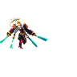 | 3rdgeneral | `f2_3rdgeneral` | attack (20), breathing (14), cast (9), castend (5), castloop (6), caststart (6), death (18), hit (3), idle (14), run (8) |
|  | Ace | `f2_ace` | attack (34), breathing (14), death (37), hit (4), idle (20), projectile (3), run (8) |
|  | Altgeneral | `f2_altgeneral` | attack (20), breathing (14), cast (10), castend (5), castloop (6), caststart (5), death (16), hit (3), idle (16), run (6) |
| 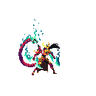 | Altgeneraltier2 | `f2_altgeneraltier2` | attack (28), breathing (14), cast (13), castend (4), castloop (5), caststart (4), death (21), hit (3), idle (13), run (6) |
| 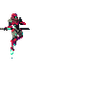 | Buildcommon | `f2_buildcommon` | attack (29), breathing (14), death (25), hit (3), idle (15), run (8) |
|  | Buildlegendary | `f2_buildlegendary` | attack (23), breathing (14), death (19), hit (3), idle (19), run (8) |
|  | Buildminion | `f2_buildminion` | attack (20), breathing (14), death (22), hit (3), idle (14) |
| 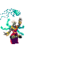 | Caligrapher | `f2_caligrapher` | attack (20), breathing (14), death (9), hit (3), idle (16), run (8) |
| 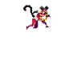 | Caster | `f2_caster` | attack (10), breathing (14), death (11), hit (3), idle (8), projectile (4), run (8) |
| 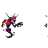 | Deathphantom | `f2_deathphantom` | attack (14), breathing (14), death (16), hit (3), idle (14), run (8) |
| 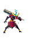 | Demononi | `f2_demononi` | attack (32), breathing (14), death (19), hit (3), idle (14), run (8) |
| 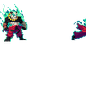 | Eclipseasura | `f2_eclipseasura` | attack (21), breathing (16), death (13), hit (3), idle (16), run (6) |
| 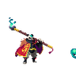 | Eternitypainter | `f2_eternitypainter` | attack (23), breathing (12), death (11), hit (3), idle (12), run (8) |
| 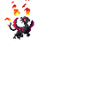 | Firewyrm | `f2_firewyrm` | attack (27), breathing (14), death (21), hit (3), idle (10), run (8) |
| 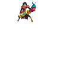 | Flareslinger | `f2_flareslinger` | attack (25), breathing (14), death (17), hit (3), idle (14), projectile (4), run (8) |
|  | General | `f2_general` | attack (18), breathing (14), cast (15), castend (5), castloop (8), caststart (9), death (14), hit (4), idle (14), run (8) |
| 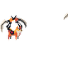 | General Skindogehai | `f2_general_skindogehai` | attack (22), breathing (14), cast (11), castend (3), castloop (6), caststart (3), death (18), hit (3), idle (9), run (8) |
| 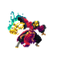 | Geomancer | `f2_geomancer` | attack (32), breathing (14), death (19), hit (3), idle (14), run (8) |
| 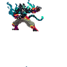 | Godpalmblacktiger | `f2_godpalmblacktiger` | attack (27), breathing (14), death (19), hit (3), idle (16), run (8) |
|  | Grandmasterzendo | `f2_grandmasterzendo` | attack (38), breathing (14), death (15), hit (3), idle (14), run (6) |
|  | Hammonnladeseeker | `f2_hammonnladeseeker` | attack (12), breathing (14), death (12), hit (3), idle (13), run (6) |
| 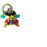 | Heartofthesonghai | `f2_heartofthesonghai` | attack (22), breathing (14), death (18), hit (3), idle (14), run (8) |
| 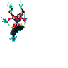 | Katara | `f2_katara` | attack (27), breathing (12), death (21), hit (3), idle (12), run (6) |
| 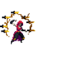 | Keshraifanblade | `f2_keshraifanblade` | attack (17), breathing (16), death (10), hit (3), idle (12), run (10) |
| 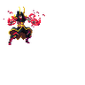 | Kibeholder | `f2_kibeholder` | attack (30), breathing (14), death (17), hit (3), idle (8), projectile (3), run (8) |
| 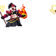 | Kindling | `f2_kindling` | attack (19), breathing (14), death (14), hit (3), idle (15), run (8) |
| 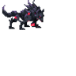 | Lanternfox | `f2_lanternfox` | attack (16), breathing (14), death (14), hit (3), idle (12), run (8) |
| 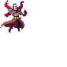 | Mage4winds | `f2_mage4winds` | attack (13), breathing (14), death (11), hit (3), idle (14), run (8) |
| 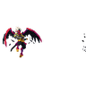 | Masteroftaikwai | `f2_masteroftaikwai` | attack (20), breathing (14), death (20), hit (3), idle (14), run (9) |
| 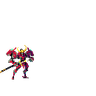 | Mech | `f2_mech` | attack (30), breathing (14), death (17), hit (3), idle (14), run (6) |
|  | Melee | `f2_melee` | attack (10), breathing (14), death (10), hit (3), idle (8), run (6) |
|  | Ogremonk02 | `f2_ogremonk02` | attack (14), breathing (11), death (23), hit (3), idle (11), run (8) |
| 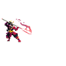 | Onnabugeisha | `f2_onnabugeisha` | attack (26), breathing (14), death (17), hit (3), idle (32), run (8) |
| 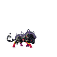 | Onyxjaguar | `f2_onyxjaguar` | attack (29), breathing (14), death (26), hit (3), idle (13), run (6) |
|  | Orizuru | `f2_orizuru` | attack (35), breathing (14), death (14), hit (3), idle (9), run (6) |
|  | Pandabear02 | `f2_pandabear02` | attack (29), breathing (10), death (11), hit (3), idle (10), run (8) |
|  | Panddo | `f2_panddo` | attack (31), breathing (14), death (25), hit (3), idle (14), run (8) |
|  | Paperdropper | `f2_paperdropper` | attack (23), breathing (14), death (14), hit (3), idle (13), run (8) |
| 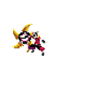 | Ranged | `f2_ranged` | attack (8), breathing (14), death (12), hit (6), idle (9), projectile (4), run (6) |
| 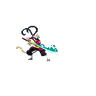 | Seenoevil | `f2_seenoevil` | attack (33), breathing (14), death (20), hit (3), idle (8), run (8) |
|  | Sekitori | `f2_sekitori` | attack (25), breathing (14), death (13), hit (3), idle (16), run (8) |
| 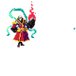 | Sepukku | `f2_sepukku` | attack (17), breathing (14), death (16), hit (3), idle (15), run (8) |
| 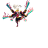 | Shidaimk2 | `f2_shidaimk2` | attack (23), breathing (14), cast (12), castend (5), castloop (8), caststart (10), death (16), hit (3), idle (14), run (8) |
|  | Sister | `f2_sister` | attack (26), breathing (14), death (20), hit (3), idle (14), run (8) |
|  | Songhaisentinel | `f2_songhaisentinel` | attack (23), breathing (14), death (45), hit (3), idle (36), run (8) |
|  | Sparrowhawk | `f2_sparrowhawk` | attack (35), breathing (14), death (20), hit (3), idle (13), run (8) |
| 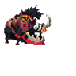 | Special | `f2_special` | attack (11), breathing (14), death (5), hit (3), idle (12), run (8) |
| 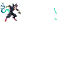 | Spellthief | `f2_spellthief` | attack (24), breathing (14), death (29), hit (3), idle (12), run (8) |
|  | Stormkage | `f2_stormkage` | attack (20), breathing (14), death (9), hit (3), idle (14), run (14) |
|  | Supekuta | `f2_supekuta` | attack (17), breathing (14), death (17), hit (3), idle (14), run (10) |
|  | Support | `f2_support` | attack (13), breathing (14), death (11), hit (3), idle (8), run (8) |
| 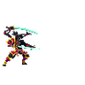 | Synergyunit | `f2_synergyunit` | attack (23), breathing (14), death (12), hit (3), idle (15), run (8) |
| 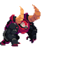 | Tank | `f2_tank` | attack (8), breathing (14), death (10), hit (3), idle (12), run (8) |
| 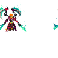 | Tier2general | `f2_tier2general` | attack (40), breathing (14), cast (13), castend (4), castloop (4), caststart (8), death (19), hit (3), idle (16), run (8) |
| 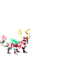 | Twilightfox | `f2_twilightfox` | attack (22), breathing (14), death (19), idle (14), run (8) |
| 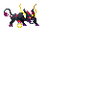 | Xho | `f2_xho` | attack (34), breathing (14), death (17), hit (3), idle (13), run (8) |
