# Vanar Kindred

69 units with a complete animation set (`idle`, `attack`, `death`).

Sprites: `public/resources/units/{id}.png` + `{id}_atlas.json` (CC0, open-duelyst).

| Sprite | Name | Id | Animations |
| --- | --- | --- | --- |
| 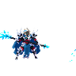 | 3rdgeneral | `f6_3rdgeneral` | attack (26), breathing (16), cast (12), castend (4), castloop (8), caststart (4), death (21), hit (3), idle (14), run (8) |
| 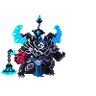 | Altgeneral | `f6_altgeneral` | attack (34), breathing (12), cast (17), castend (4), castloop (6), caststart (4), death (13), hit (3), idle (12), run (10) |
| 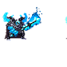 | Altgeneraltier2 | `f6_altgeneraltier2` | attack (30), breathing (14), cast (13), castend (4), castloop (6), caststart (4), death (19), hit (3), idle (16), run (8) |
| 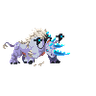 | Arcticrhyno | `f6_arcticrhyno` | attack (17), breathing (8), death (14), hit (3), idle (10), run (8) |
| 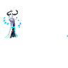 | Auroraguardian | `f6_auroraguardian` | attack (23), breathing (14), death (15), hit (3), idle (12), run (6) |
| 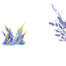 | Blazingspines | `f6_blazingspines` | attack (20), breathing (15), death (9), hit (3), idle (16) |
| 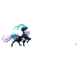 | Bloodsurge | `f6_bloodsurge` | attack (22), breathing (14), death (25), hit (3), idle (19), run (8) |
|  | Bonechillbarrier | `f6_bonechillbarrier` | attack (10), breathing (12), death (13), hit (3), idle (6) |
|  | Buildcommon | `f6_buildcommon` | attack (34), breathing (16), death (13), hit (3), idle (14), run (8) |
| 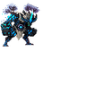 | Buildlegendary | `f6_buildlegendary` | attack (25), breathing (14), death (25), hit (3), idle (18), run (12) |
|  | Buildminion | `f6_buildminion` | attack (20), breathing (14), death (22), hit (3), idle (14) |
| 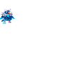 | Bur | `f6_bur` | attack (27), breathing (14), death (22), hit (4), idle (16), run (4) |
| 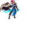 | Circulus | `f6_circulus` | attack (20), breathing (14), death (20), hit (3), idle (12), run (8) |
| 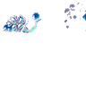 | Crystalbeetle | `f6_crystalbeetle` | attack (37), breathing (14), death (24), hit (3), idle (10), run (8) |
|  | Doofybear | `f6_doofybear` | attack (19), breathing (14), death (12), hit (3), idle (14), run (8) |
| 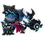 | Draugarlord | `f6_draugarlord` | attack (27), breathing (14), death (10), hit (3), idle (14), run (8) |
| 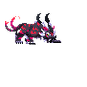 | Eldersaberspine | `f6_eldersaberspine` | attack (22), breathing (14), death (12), hit (3), idle (14), run (8) |
| 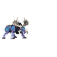 | Elklodon | `f6_elklodon` | attack (13), breathing (14), death (18), hit (3), idle (11), run (8) |
| 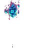 | Evilcrystalwisp | `f6_evilcrystalwisp` | attack (29), breathing (34), death (29), hit (3), idle (16), run (12) |
|  | Explodingwall | `f6_explodingwall` | attack (24), breathing (14), death (18), hit (3), idle (8) |
| 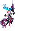 | Faiefestive | `f6_faiefestive` | attack (10), breathing (14), cast (9), castend (6), castloop (8), caststart (3), death (10), hit (3), idle (13), run (8) |
|  | Fenrirwarmaster | `f6_fenrirwarmaster` | attack (19), breathing (14), death (20), hit (3), idle (12), run (8) |
| 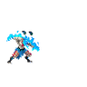 | Fenrirwerewolf | `f6_fenrirwerewolf` | attack (29), breathing (14), death (26), hit (3), idle (16), run (5) |
| 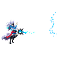 | Freeblade | `f6_freeblade` | attack (29), breathing (14), death (21), hit (3), idle (16), run (8) |
| 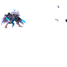 | Frostbitehawker | `f6_frostbitehawker` | attack (24), breathing (14), death (8), hit (3), idle (8), run (6) |
| 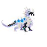 | Frostdrake | `f6_frostdrake` | attack (28), breathing (14), death (18), hit (3), idle (18), run (8) |
| 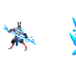 | Frostiva | `f6_frostiva` | attack (36), breathing (14), death (45), hit (3), idle (13), run (6) |
|  | General | `f6_general` | attack (10), breathing (14), cast (9), castend (6), castloop (8), caststart (3), death (10), hit (3), idle (13), run (8) |
| 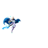 | Ghostseraphim | `f6_ghostseraphim` | attack (40), breathing (14), death (25), hit (3), idle (10), run (7) |
|  | Grandmasterembla | `f6_grandmasterembla` | attack (38), breathing (14), death (16), hit (3), idle (18), run (10) |
| 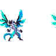 | Greatwhitenorth | `f6_greatwhitenorth` | attack (21), breathing (14), death (17), hit (3), idle (14), run (8) |
| 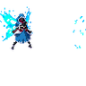 | Huldra | `f6_huldra` | attack (23), breathing (14), death (15), hit (3), idle (10), run (6) |
| 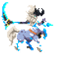 | Icedryad | `f6_icedryad` | attack (18), breathing (14), death (11), hit (3), idle (14), run (8) |
| 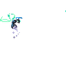 | Icehornet | `f6_icehornet` | attack (25), breathing (14), death (20), hit (3), idle (16), run (8) |
| 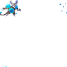 | Icy | `f6_icy` | attack (31), breathing (14), death (18), hit (3), idle (16), run (8) |
| 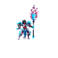 | Ilenamk2 | `f6_ilenamk2` | attack (31), breathing (14), cast (14), castend (3), castloop (8), caststart (3), death (14), hit (3), idle (18), run (8) |
| 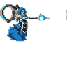 | Justice | `f6_justice` | attack (17), breathing (12), death (10), hit (3), idle (12), run (12) |
| 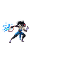 | Kindredhunter | `f6_kindredhunter` | attack (22), breathing (14), death (15), hit (3), idle (8), run (8) |
| 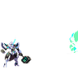 | Mech | `f6_mech` | attack (29), breathing (18), death (9), hit (3), idle (16), run (6) |
| 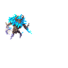 | Minitreant | `f6_minitreant` | attack (25), breathing (14), death (27), hit (3), idle (13), run (8) |
| 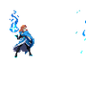 | Motherofdrakes | `f6_motherofdrakes` | attack (20), breathing (14), death (21), hit (3), idle (18), projectile (6), run (8) |
| 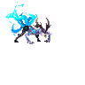 | Myriad | `f6_myriad` | attack (15), breathing (14), death (18), hit (3), idle (12), run (8) |
|  | Mythronquest | `f6_mythronquest` | attack (26), breathing (14), death (24), hit (3), idle (14), run (8) |
| 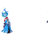 | Perfectreflection | `f6_perfectreflection` | attack (32), breathing (14), death (14), hit (3), idle (16), run (8) |
|  | Ravager | `f6_ravager` | attack (14), breathing (14), death (13), hit (3), idle (10), run (8) |
| 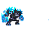 | Seismicelemental | `f6_seismicelemental` | attack (36), breathing (12), death (15), hit (3), idle (12), run (8) |
| 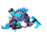 | Sentinel | `f6_sentinel` | attack (12), breathing (14), death (8), hit (3), idle (12), run (8) |
| 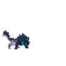 | Shadowvespyr | `f6_shadowvespyr` | attack (27), breathing (14), death (18), hit (3), idle (15), run (8) |
|  | Sinergyunit | `f6_sinergyunit` | attack (19), breathing (14), death (15), hit (3), idle (16), run (8) |
| 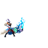 | Sister | `f6_sister` | attack (29), breathing (14), death (15), hit (3), idle (14), run (8) |
| 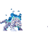 | Sleetdasher | `f6_sleetdasher` | attack (16), breathing (14), death (14), hit (3), idle (12), run (8) |
| 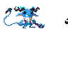 | Snowchaser | `f6_snowchaser` | attack (23), breathing (7), death (13), hit (11), idle (20), run (8) |
|  | Snowchasermk2 | `f6_snowchasermk2` | attack (23), breathing (14), death (12), hit (10), idle (20), run (8) |
|  | Snowman | `f6_snowman` | attack (15), breathing (14), death (11), hit (3), idle (12), run (8) |
| 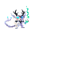 | Snowrippler | `f6_snowrippler` | attack (32), breathing (14), death (19), hit (3), idle (12), run (6) |
| 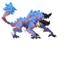 | Snowwyvern | `f6_snowwyvern` | attack (18), breathing (10), death (12), hit (3), idle (10), run (8) |
|  | Spiritwolf | `f6_spiritwolf` | attack (29), breathing (14), death (19), hit (3), idle (12), run (8) |
|  | Tier2general | `f6_tier2general` | attack (40), breathing (12), cast (8), castend (6), castloop (6), caststart (5), death (10), hit (3), idle (12), run (8) |
| 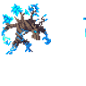 | Treant | `f6_treant` | attack (31), breathing (14), death (14), hit (3), idle (16), run (8) |
| 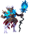 | Tundraguardian | `f6_tundraguardian` | attack (40), breathing (14), death (15), hit (3), idle (14), run (8) |
| 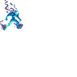 | Vanarsentinel | `f6_vanarsentinel` | attack (23), breathing (14), death (31), hit (3), idle (20), run (8) |
| 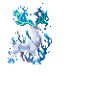 | Voiceofthewind | `f6_voiceofthewind` | attack (21), breathing (14), death (19), hit (3), idle (16), run (8) |
| 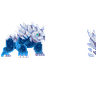 | Waterbear | `f6_waterbear` | attack (33), breathing (14), death (14), hit (3), idle (14), run (8) |
|  | Waterelemental | `f6_waterelemental` | attack (14), breathing (18), death (14), hit (3), idle (9), run (6) |
|  | Whitewyvern | `f6_whitewyvern` | attack (21), breathing (10), death (15), hit (3), idle (10), run (8) |
| 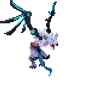 | Wolfraven | `f6_wolfraven` | attack (9), breathing (11), death (9), hit (4), idle (10), run (6) |
| 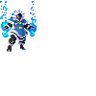 | Ynuyttracker | `f6_ynuyttracker` | attack (28), breathing (14), death (20), hit (3), idle (8), run (10) |
|  | Ynuytunleashed | `f6_ynuytunleashed` | attack (17), breathing (14), death (20), hit (3), idle (16), run (8) |
|  | Ynuytwarlock | `f6_ynuytwarlock` | attack (21), breathing (14), death (24), hit (3), idle (7), run (8) |
