# Vetruvian Imperium

61 units with a complete animation set (`idle`, `attack`, `death`).

Sprites: `public/resources/units/{id}.png` + `{id}_atlas.json` (CC0, open-duelyst).

| Sprite | Name | Id | Animations |
| --- | --- | --- | --- |
|  | 3rdgeneral | `f3_3rdgeneral` | attack (22), breathing (14), cast (15), castend (3), castLoop (14), castStart (3), death (17), hit (3), idle (16), run (8) |
|  | Allomancer | `f3_allomancer` | attack (54), breathing (14), death (29), hit (3), idle (12), run (8) |
| 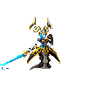 | Altgeneral | `f3_altgeneral` | attack (22), breathing (14), cast (15), castend (3), castloop (12), caststart (4), death (22), hit (3), idle (14), run (8) |
| 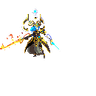 | Altgeneraltier2 | `f3_altgeneraltier2` | attack (25), breathing (14), cast (9), castend (3), castloop (12), caststart (3), death (19), hit (3), idle (14), run (8) |
| 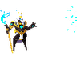 | Anubis | `f3_anubis` | attack (22), breathing (14), death (17), hit (3), idle (14), run (8) |
|  | Aymarahealer | `f3_aymarahealer` | attack (19), breathing (14), death (12), hit (3), idle (14), run (7) |
|  | Badlandsscout | `f3_badlandsscout` | attack (19), breathing (14), death (21), hit (3), idle (14), run (8) |
| 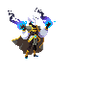 | Bobble | `f3_bobble` | attack (26), breathing (14), death (13), hit (3), idle (8), run (8) |
|  | Buildcommon | `f3_buildcommon` | attack (18), breathing (14), death (13), hit (3), idle (13), run (8) |
| 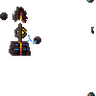 | Buildminion | `f3_buildminion` | attack (20), breathing (14), death (22), hit (3), idle (14) |
| 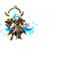 | Ciphyronmk2 | `f3_ciphyronmk2` | attack (22), breathing (16), cast (13), castend (3), castloop (14), caststart (3), death (18), hit (3), idle (16), run (8) |
|  | Curseddervish | `f3_curseddervish` | attack (22), breathing (14), death (15), hit (3), idle (15), run (8) |
|  | Deathobelysk | `f3_deathobelysk` | attack (17), breathing (14), death (22), hit (3), idle (14) |
| 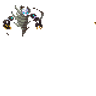 | Dervish | `f3_dervish` | attack (13), breathing (12), death (20), hit (3), idle (12), run (8) |
| 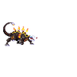 | Desertspirit | `f3_desertspirit` | attack (30), breathing (16), death (15), hit (3), idle (14), run (6) |
| 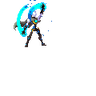 | Dreamshaper | `f3_dreamshaper` | attack (20), breathing (14), death (16), hit (3), idle (14), run (8) |
|  | Dunecaster | `f3_dunecaster` | attack (14), breathing (14), death (11), hit (3), idle (14), run (12) |
|  | Duskweaver | `f3_duskweaver` | attack (33), breathing (14), death (53), hit (3), idle (24), run (14) |
| 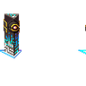 | Endlessobelysk | `f3_endlessobelysk` | attack (25), breathing (14), death (18), hit (3), idle (14) |
|  | Eurus | `f3_eurus` | attack (22), breathing (14), death (13), hit (3), idle (14), run (8) |
|  | Falcius | `f3_falcius` | attack (27), breathing (12), death (17), hit (3), idle (12), run (8) |
| 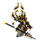 | General | `f3_general` | attack (11), breathing (14), cast (15), castend (10), castloop (6), caststart (16), death (14), hit (3), idle (12), run (8) |
|  | Glassmirage | `f3_glassmirage` | attack (13), breathing (15), death (11), hit (3), idle (14), run (8) |
| 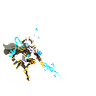 | Grandmasternoshrak | `f3_grandmasternoshrak` | attack (35), breathing (14), death (24), hit (3), idle (20), run (8) |
|  | Incinera | `f3_incinera` | attack (18), breathing (14), death (17), hit (3), idle (14), run (8) |
| 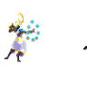 | Insightcaster | `f3_insightcaster` | attack (21), breathing (14), death (17), hit (3), idle (14), run (8) |
| 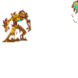 | Irondervish | `f3_irondervish` | attack (27), breathing (16), death (9), hit (3), idle (16), run (8) |
|  | Ishtarhunter | `f3_ishtarhunter` | attack (17), breathing (14), death (20), hit (3), idle (12), run (8) |
| 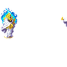 | Keeperofages | `f3_keeperofages` | attack (29), breathing (14), death (22), hit (3), idle (14), run (8) |
| 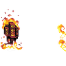 | Lavastormobelysk | `f3_lavastormobelysk` | attack (17), breathing (14), death (25), hit (3), idle (14) |
|  | Mech | `f3_mech` | attack (24), breathing (14), death (19), hit (3), idle (14), run (8) |
|  | Miniscarab | `f3_miniscarab` | attack (34), breathing (24), death (36), hit (3), idle (20), run (16) |
| 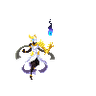 | Nimbus | `f3_nimbus` | attack (44), breathing (14), death (17), hit (3), idle (9), run (8) |
|  | Obelyskduskwind | `f3_obelyskduskwind` | attack (14), breathing (12), death (20), hit (3), idle (11) |
| 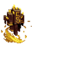 | Obelyskgoldenflame | `f3_obelyskgoldenflame` | attack (12), breathing (13), death (20), hit (3), idle (11) |
| 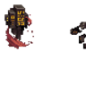 | Obelyskredsand | `f3_obelyskredsand` | attack (12), breathing (12), death (22), hit (3), idle (11) |
| 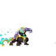 | Onyxpantheran | `f3_onyxpantheran` | attack (26), breathing (14), death (16), hit (3), idle (14), run (8) |
|  | Orbweaver | `f3_orbweaver` | attack (16), breathing (14), death (10), hit (4), idle (10), run (8) |
|  | Palacetrinketeer | `f3_palacetrinketeer` | attack (9), breathing (12), death (14), hit (3), idle (10), run (8) |
| 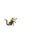 | Pax | `f3_pax` | attack (19), breathing (14), death (12), hit (3), idle (33), run (8) |
| 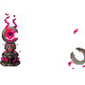 | Plague Totem | `f3_plague_totem` | attack (23), breathing (14), death (22), hit (3), idle (14) |
| 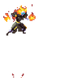 | Pyromancer | `f3_pyromancer` | attack (12), breathing (14), death (13), hit (3), idle (14), run (8) |
|  | Rae | `f3_rae` | attack (35), breathing (14), death (19), hit (3), idle (16), run (8) |
|  | Rehorah | `f3_rehorah` | attack (21), breathing (14), death (15), hit (3), idle (14), run (8) |
| 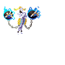 | Sakkak | `f3_sakkak` | attack (29), breathing (14), death (36), hit (4), idle (14), run (8) |
| 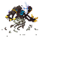 | Sandhowler | `f3_sandhowler` | attack (24), breathing (14), death (21), hit (3), idle (14), run (8) |
| 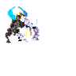 | Scarabtera | `f3_scarabtera` | attack (31), breathing (14), death (13), hit (3), idle (10), run (8) |
| 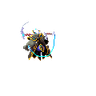 | Sinergyunit | `f3_sinergyunit` | attack (22), breathing (14), death (16), hit (3), idle (14), run (8) |
| 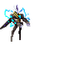 | Sirocco | `f3_sirocco` | attack (39), breathing (14), death (14), hit (3), idle (14), run (10) |
|  | Sister | `f3_sister` | attack (39), breathing (14), death (24), hit (3), idle (16), run (8) |
|  | Starfirescarab | `f3_starfirescarab` | attack (19), breathing (14), death (9), hit (3), idle (14), run (8) |
| 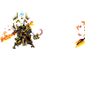 | Tier2general | `f3_tier2general` | attack (22), breathing (14), cast (15), castend (3), castloop (8), caststart (3), death (21), hit (3), idle (14), run (8) |
|  | Trifectaperfecta | `f3_trifectaperfecta` | attack (15), breathing (14), death (23), hit (3), idle (12) |
|  | Windgiver | `f3_windgiver` | attack (33), breathing (14), death (29), hit (3), idle (14), run (8) |
| 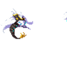 | Windshriek | `f3_windshriek` | attack (14), breathing (14), death (17), hit (3), idle (16), run (8) |
| 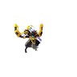 | Windslicer | `f3_windslicer` | attack (19), breathing (14), death (18), hit (3), idle (16), run (8) |
|  | Windstriker | `f3_windstriker` | attack (22), breathing (12), death (10), hit (3), idle (12), run (8) |
| 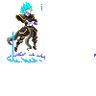 | Zephyr | `f3_zephyr` | attack (21), breathing (14), death (15), hit (3), idle (13), run (8) |
|  | Zirixfestive | `f3_zirixfestive` | attack (11), breathing (14), cast (15), castend (10), castloop (6), caststart (16), death (14), hit (3), idle (12), run (8) |
| 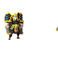 | Zodiac | `f3_zodiac` | attack (22), breathing (14), death (20), hit (3), idle (15), run (10) |
| 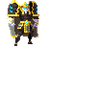 | Zodiac02 | `f3_zodiac02` | attack (21), breathing (14), death (20), hit (3), idle (15), run (10) |
